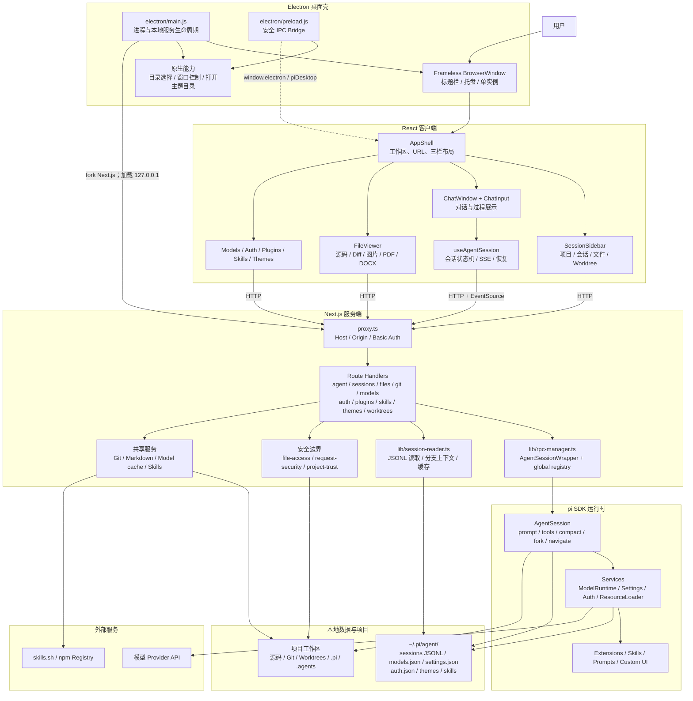
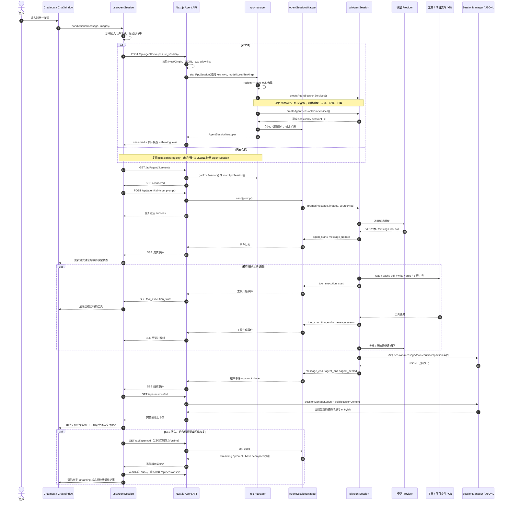

# Pi Web Desktop 架构与核心流程

本文用于帮助开发者快速理解数字化AI助手（Pi Web Desktop）的整体架构、核心模块、AgentSession 生命周期、实时对话链路以及会话持久化机制。

## 1. 项目概览

Pi Web Desktop 是一个 Electron-first 的 pi coding agent 桌面客户端。

整个系统可以概括为五层：

```text
Electron 桌面壳
    ↓
React 客户端
    ↓ HTTP / SSE
Next.js Route Handlers
    ↓
Pi SDK AgentSession
    ↓
本地 JSONL / 项目文件 / 模型 Provider
```

其中：

- Electron 管理桌面窗口、托盘、原生能力和本地 Next.js 服务。
- React 管理工作区、聊天、文件预览和设置界面。
- Next.js Route Handlers 提供本地 API 和安全边界。
- `lib/rpc-manager.ts` 管理进程内 Pi `AgentSession`。
- SSE 提供实时事件更新。
- JSONL 会话文件是消息和分支状态的最终事实来源。

## 2. 总体架构图



## 3. 架构分层

### 3.1 Electron 桌面壳

主要入口是 [`electron/main.js`](../electron/main.js)。

Electron 主进程负责：

- 启动本地 Next.js 服务。
- 创建无边框 `BrowserWindow`。
- 提供最小化、最大化和关闭等窗口控制。
- 提供原生目录选择器。
- 创建系统托盘。
- 保证应用单实例运行。
- 在默认端口被占用时自动选择其他本地端口。
- 安装打包内置技能。
- 将服务端启动日志写入 `pi-web-server.log`。

Electron 只负责桌面容器和本地服务生命周期，Agent 的核心逻辑不运行在 Electron 主进程中。

关键文件：

| 文件 | 职责 |
| --- | --- |
| [`electron/main.js`](../electron/main.js) | 窗口、托盘、Next.js 服务和应用生命周期 |
| [`electron/preload.js`](../electron/preload.js) | 通过 `contextBridge` 暴露受限 IPC API |
| [`electron/bundled-skills.js`](../electron/bundled-skills.js) | 将缺失的内置技能安装到用户技能目录 |

Preload 暴露两组客户端能力：

```text
window.electron
└── windowControls
    ├── minimize
    ├── toggleMaximize
    ├── close
    ├── isMaximized
    └── onMaximizedChange

window.piDesktop
├── selectDirectory
├── openThemeFolder
└── openThemeDocs
```

### 3.2 React 客户端

主布局入口是 [`components/AppShell.tsx`](../components/AppShell.tsx)。

界面大致分为三栏：

```text
┌──────────────┬───────────────────────┬─────────────────┐
│ 左侧栏        │ 中间聊天区             │ 右侧文件面板      │
│              │                       │                 │
│ 项目          │ ChatWindow            │ FileViewer      │
│ Worktree     │ MessageView           │ Source          │
│ 会话树        │ ProcessGroup          │ Diff            │
│ 文件 Explorer │ ChatInput             │ PDF / DOCX      │
└──────────────┴───────────────────────┴─────────────────┘
```

主要组件：

| 组件 | 职责 |
| --- | --- |
| [`components/AppShell.tsx`](../components/AppShell.tsx) | 全局布局、URL session 状态、工作区、文件标签和面板组织 |
| [`components/SessionSidebar.tsx`](../components/SessionSidebar.tsx) | 项目、会话树、worktree 和文件 Explorer |
| [`components/ChatWindow.tsx`](../components/ChatWindow.tsx) | 消息列表、过程步骤、流式展示和聊天交互 |
| [`components/ChatInput.tsx`](../components/ChatInput.tsx) | 输入、模型、工具、thinking 和 slash command |
| [`components/MessageView.tsx`](../components/MessageView.tsx) | 单条消息和内容块展示 |
| [`components/ProcessGroup.tsx`](../components/ProcessGroup.tsx) | thinking、工具调用和过程步骤分组 |
| [`components/FileViewer.tsx`](../components/FileViewer.tsx) | 源码、diff、图片、音频、PDF 和 DOCX 预览 |
| [`components/ModelsConfig.tsx`](../components/ModelsConfig.tsx) | 模型和认证配置 |
| [`components/PluginsConfig.tsx`](../components/PluginsConfig.tsx) | 插件与 package resource 管理 |
| [`components/SkillsConfig.tsx`](../components/SkillsConfig.tsx) | 技能搜索、安装、更新和启停 |

### 3.3 客户端会话状态机

聊天核心状态集中在 [`hooks/useAgentSession.ts`](../hooks/useAgentSession.ts)，而不是直接分散在 `ChatWindow` 中。

该 hook 负责：

- 创建或恢复 AgentSession。
- 加载 JSONL 历史消息。
- 发送 prompt 和图片。
- 建立、关闭和重连 SSE。
- 管理流式消息状态。
- 管理工具执行状态。
- 管理 compaction 状态。
- 管理模型和 thinking level。
- 处理 Fork 与会话内分支导航。
- 处理 extension UI。
- 管理 steer、follow-up 和消息队列。
- 在 SSE 丢失后与服务端状态进行 reconciliation。

可以把它理解为 React 客户端和 Pi SDK 服务端之间的会话协议适配层。

### 3.4 Next.js 服务端

`app/api/**/route.ts` 是客户端与本地能力之间的 API 层。

主要 API 域：

| API | 用途 |
| --- | --- |
| `/api/agent/**` | AgentSession 生命周期、命令和 SSE |
| `/api/sessions/**` | JSONL 会话读取、删除、重命名和导出 |
| `/api/files/**` | 文件访问、上传和预览 |
| `/api/file-index` | 文件搜索索引 |
| `/api/git/**` | Git status 和 diff |
| `/api/worktrees` | Git worktree 管理 |
| `/api/models**` | 模型列表和模型配置 |
| `/api/auth/**` | OAuth、API key 和 provider 状态 |
| `/api/plugins` | 插件管理 |
| `/api/skills/**` | 技能列表、搜索、安装和更新 |
| `/api/themes/**` | pi / PI-TUI 主题解析 |
| `/api/project-trust` | 项目资源信任状态 |

请求首先经过 [`proxy.ts`](../proxy.ts)：

```text
Browser request
      ↓
Host 校验
      ↓
Origin / Sec-Fetch-Site 校验
      ↓
PI_WEB_PASSWORD Basic Auth
      ↓
Route Handler
```

相关安全模块：

| 文件 | 职责 |
| --- | --- |
| [`proxy.ts`](../proxy.ts) | Next.js 请求统一入口 |
| [`lib/request-security.ts`](../lib/request-security.ts) | Host、Origin 和浏览器跨站请求校验 |
| [`lib/web-auth.ts`](../lib/web-auth.ts) | Basic Auth 验证 |
| [`lib/file-access.ts`](../lib/file-access.ts) | 文件访问 allow-list |
| [`lib/project-trust.ts`](../lib/project-trust.ts) | 项目扩展、技能、prompt 和 package resource 信任门禁 |

### 3.5 Pi SDK 运行时

服务端 Agent 核心位于 [`lib/rpc-manager.ts`](../lib/rpc-manager.ts)。

它在 Pi SDK 之上提供 `AgentSessionWrapper`，用于统一管理：

- AgentSession 创建与恢复。
- prompt、steer、follow-up 和 abort。
- 模型和 thinking level 切换。
- 工具激活状态。
- Fork、分支导航和 compaction。
- Extension UI 请求与响应。
- SDK 事件订阅和 SSE 投影。
- 空闲会话回收。
- 服务关闭时的资源释放。

## 4. AgentSession Registry 与生命周期

### 4.1 全局 Registry

每个运行中的 session id 对应一个 `AgentSessionWrapper`。

Registry 存放在：

```typescript
globalThis.__piSessions
```

结构大致如下：

```text
globalThis.__piSessions
├── session-id-A → AgentSessionWrapper
├── session-id-B → AgentSessionWrapper
└── session-id-C → AgentSessionWrapper
```

使用 `globalThis` 而不是普通模块变量，是因为 Next.js 开发模式会 hot reload。普通模块级 `Map` 可能在 reload 后丢失，而 `globalThis` 可以保存运行中的 AgentSession。

此外还有：

```text
globalThis.__piStartLocks
└── 防止同一个 session 被并发重复创建

globalThis.__piStartingSessionCwds
└── 跟踪正在启动 AgentSession 的 cwd
```

### 4.2 AgentSession 启动过程

`startRpcSession()` 的主要流程：

```text
检查 registry
    ↓ 已存在
直接复用 wrapper
    ↓ 不存在
检查 start lock，避免并发重复创建
    ↓
打开或创建 SessionManager
    ↓
检查项目资源信任状态
    ↓
createAgentSessionServices()
    ↓
解析可见模型、默认模型、thinking level
    ↓
createAgentSessionFromServices()
    ↓
设置可用工具
    ↓
创建 AgentSessionWrapper
    ↓
订阅 SDK 事件
    ↓
注册到 globalThis.__piSessions
    ↓
绑定 Extensions UI
```

这里有一个重要设计：

> 先创建 services 并加载 extension provider，再恢复会话文件中保存的模型。

如果先恢复模型，而对应 provider 由 extension 注册，服务端可能无法找到该模型。

### 4.3 空闲回收

每个 `AgentSessionWrapper` 空闲十分钟后自动关闭。

以下状态不属于空闲：

- 正在执行 prompt。
- 正在流式输出。
- 正在执行 compaction。
- 正在执行 bash。

关闭时还需要：

- 取消 SDK 事件订阅。
- 结束 extension UI 请求。
- 释放 AgentSession 和相关 services。
- 从全局 registry 中删除 wrapper。

## 5. 核心对话流程图



## 6. 核心对话流程详解

### 6.1 创建或恢复会话

#### 新会话

客户端首先请求：

```http
POST /api/agent/new
Content-Type: application/json
```

示例请求体：

```json
{
  "cwd": "/project/path",
  "type": "ensure_session",
  "provider": "provider-name",
  "modelId": "model-id",
  "toolNames": ["read", "bash", "edit"],
  "thinkingLevel": "high"
}
```

服务端依次执行：

1. 校验 Host 和 Origin。
2. 校验 `Content-Type`。
3. 校验 `cwd` 是否存在且是目录。
4. 解析 symlink 后的真实路径。
5. 检查真实路径是否位于允许访问的根目录中。
6. 创建 Pi `AgentSession`。
7. 返回真实 `sessionId`、实际模型和 thinking level。

新会话使用随机临时 key 调用 `startRpcSession()`，避免两个同时发起的新会话错误共享同一个启动锁。

#### 已有会话

已有会话先检查全局 registry：

```text
wrapper 存在且存活 → 直接复用
wrapper 不存在      → 根据 session id 找 JSONL → 恢复 AgentSession
```

会话 id 到 JSONL 路径的映射由 `lib/session-reader.ts` 缓存。

### 6.2 先建立 SSE

客户端在发送 prompt 前先打开：

```http
GET /api/agent/:id/events
```

服务端建立连接后发送：

```json
{
  "type": "connected",
  "sessionId": "session-id"
}
```

前端等待 `connected` 后才发送 prompt。这样可以避免 Agent 已经开始生成事件，但 SSE 尚未建立而漏掉开头事件。

SSE 每 30 秒发送 heartbeat：

```text
:\n\n
```

它用于避免服务器、浏览器或中间代理将长时间没有业务事件的连接判定为超时。

### 6.3 发送 prompt

客户端请求：

```http
POST /api/agent/:id
Content-Type: application/json
```

请求体示例：

```json
{
  "type": "prompt",
  "message": "帮我修复这个问题",
  "images": []
}
```

`AgentSessionWrapper.send()` 调用：

```typescript
inner.prompt(message, {
  images,
  source: "rpc"
});
```

该调用采用 fire-and-forget：

- HTTP 请求不等待模型生成完成。
- HTTP 只表示 prompt 已经被服务端接受。
- 后续过程通过 SSE 返回。

### 6.4 模型与工具循环

Pi SDK 内部执行类似下面的循环：

```text
构建上下文
    ↓
调用模型 Provider
    ↓
模型返回内容
    ├── 普通文本 ─────────────┐
    ├── thinking             │
    └── tool call            │
           ↓                 │
       执行工具               │
           ↓                 │
       返回 tool result       │
           ↓                 │
       再次调用模型 ───────────┘
    ↓
得到最终回答
```

常见事件及客户端行为：

| 事件 | UI 行为 |
| --- | --- |
| `agent_start` | 标记 Agent 开始运行 |
| `message_start` | 建立流式消息 |
| `message_update` | 更新文本或 thinking |
| `tool_execution_start` | 显示正在运行的工具 |
| `tool_execution_end` | 标记工具执行完成 |
| `message_end` | 将完整消息放入消息列表 |
| `agent_end` | 当前 Agent turn 结束 |
| `agent_settled` | Agent、队列和扩展工作均已稳定 |
| `prompt_done` | 当前 RPC prompt 完成 |
| `auto_retry_start` | Provider 开始自动重试 |
| `auto_retry_end` | Provider 自动重试结束 |
| `compaction_start` | 开始压缩上下文 |
| `compaction_end` | 上下文压缩完成 |
| `queue_update` | 更新 steer 和 follow-up 队列 |
| `extension_ui_request` | 扩展请求用户交互 |

客户端不会投影所有 SDK 事件。高频且当前 UI 不消费的事件会在 SSE Route Handler 中过滤，避免重复序列化大量 payload。

### 6.5 JSONL 持久化

Pi SDK 使用 `SessionManager` 持久化会话。

默认目录：

```text
~/.pi/agent/sessions/
└── <encoded-cwd>/
    └── <timestamp>_<uuid>.jsonl
```

会话内容大致如下：

```jsonl
{"type":"session","id":"...","cwd":"/project","timestamp":"..."}
{"type":"model_change","provider":"...","modelId":"..."}
{"type":"message","message":{"role":"user","content":"..."}}
{"type":"message","message":{"role":"assistant","content":[...]}}
{"type":"message","message":{"role":"toolResult","content":[...]}}
{"type":"compaction","summary":"..."}
```

[`lib/session-reader.ts`](../lib/session-reader.ts) 负责：

- 扫描所有会话。
- 缓存 session id 与文件路径的双向映射。
- 读取 JSONL entries。
- 构建当前分支上下文。
- 将 SDK entry 转换为 UI message。
- 规范化 tool call 字段。
- 延迟加载 thinking 和大型工具结果图片。
- 将 main checkout 和 linked worktree 的会话归入同一个项目。

### 6.6 用持久化结果收敛 UI

流式消息只负责即时体验，不是最终事实来源。

Agent 运行结束后，客户端再次请求：

```http
GET /api/sessions/:id
```

然后从 JSONL 重新获得：

- 最终消息。
- `entryIds`。
- 当前分支 leaf。
- branch tree。
- 模型状态。
- thinking level。
- compaction 条目。

这样可以避免：

- 流式 chunk 丢失。
- tool call 字段不完整。
- optimistic 用户消息重复。
- SSE 事件乱序。
- 后台标签页冻结后恢复错误。
- compaction 后前端上下文不一致。

因此系统有两条数据路径：

```text
实时路径：Pi SDK Event → SSE → React 临时流式状态

事实路径：SessionManager → JSONL → Session API → React 最终状态
```

这是项目最重要的设计之一。

## 7. SSE 断线与状态恢复

SSE 是实时主通道，但不是唯一保障。

客户端在 Agent 运行期间每 15 秒请求：

```http
GET /api/agent/:id
```

并且会在以下时机立即检查：

- 浏览器标签页回到前台。
- 网络重新 online。
- prompt POST 可能已经到达服务端，但客户端没有收到完成事件。
- SSE 连接关闭。

服务端状态大致如下：

```json
{
  "running": true,
  "state": {
    "isStreaming": true,
    "isPromptRunning": true,
    "isBashRunning": false,
    "isCompacting": false
  }
}
```

如果客户端认为仍在运行，但服务端已经空闲，客户端会：

1. 重新读取 JSONL 会话。
2. 清理 streaming bubble。
3. 清理运行中工具状态。
4. 触发完成通知。
5. 延迟关闭 SSE。

整体职责可以总结为：

```text
SSE       = 实时主通道
状态轮询   = 补偿与恢复通道
JSONL     = 最终事实来源
```

为了避免过早关闭 SSE，客户端在 Agent 结束后还有一个 grace window。它会继续检查服务端是否出现：

- retry。
- compaction。
- extension 启动的新 Agent run。
- 尚未完成的 RPC prompt。

只有确认服务端空闲后才真正关闭连接。

## 8. Fork 与会话内分支

项目存在两种不同的分支概念，不能混淆。

### 8.1 Fork

```text
原会话.jsonl
       ↓ Fork
新会话.jsonl
```

特点：

- 创建新的会话文件。
- 新文件通过 `parentSession` 指向父会话。
- 新会话显示在左侧会话树中。
- Fork 后旧 wrapper 必须立即销毁。

Fork 前的位置决定新会话内容：

- 在第一条消息前 Fork：创建一个空会话，并链接到父会话。
- 在历史中间 Fork：复制从根到 Fork 点之前的路径。

Fork 完成后必须销毁旧 wrapper，是因为 SDK 的相关操作可能原地改变内部 session 状态。不能让 registry 中旧 session id 继续指向已经发生变化的实例。

### 8.2 会话内分支

```text
同一个 session.jsonl
         │
         ├── entry A
         │    └── entry B
         │
         └── entry C
```

特点：

- 不创建新 JSONL。
- 通过 entry 的 `parentId` 构成树。
- `navigate_tree` 切换当前 leaf。
- `BranchNavigator` 展示和切换当前分支。
- `/api/sessions/:id/context?leafId=...` 构建指定 leaf 的消息上下文。

简化理解：

```text
Fork          = 创建新的会话文件
navigate_tree = 在同一个会话文件中切换分支
```

## 9. 文件与项目安全边界

Pi Web Desktop 不是一个任意文件系统浏览器。

`/api/files` 可访问的根目录主要来自：

- 会话 cwd。
- 解析后的主项目根目录。
- `~/pi-cwd-*` 自动工作目录。
- 显式通过 `allowFileRoot()` 注册的位置。
- 新建或选择后加入 allow-list 的 worktree 和 cwd。

新会话 cwd 校验会同时解析：

- 请求目录的 realpath。
- 所有允许根目录的 realpath。

这样可以防止位于允许目录中的 symlink 将访问重定向到允许范围之外。

项目内以下资源可能执行代码：

- extensions。
- package resources。
- prompts。
- `.agents/skills`。

因此它们在 Pi SDK 导入或执行前必须经过 project trust gate。

## 10. 模型、认证和资源加载

新 AgentSession 创建时，服务端会一次性确定：

- 可见模型 scope。
- 用户显式选择的模型。
- 默认模型。
- thinking level。
- 激活工具。
- 项目是否可信。
- extensions、skills、prompts 和 package resources。

模型与 thinking level 会在 AgentSession 构造阶段原子传入，避免 prompt 看到中间配置状态。

模型来源可能包括：

- Pi 内置 provider。
- `models.json` 中的自定义 provider。
- extension 注册的 provider。

认证信息由 Pi SDK 的认证存储管理。Web API 只提供配置和状态操作，不应向客户端返回原始 API key。

## 11. 推荐代码阅读顺序

如果要深入熟悉项目，建议按以下顺序阅读。

### 第一步：理解页面骨架

1. [`components/AppShell.tsx`](../components/AppShell.tsx)
2. [`components/SessionSidebar.tsx`](../components/SessionSidebar.tsx)
3. [`components/ChatWindow.tsx`](../components/ChatWindow.tsx)

目标：理解工作区、三栏布局、会话选择和聊天区如何组合。

### 第二步：理解客户端会话状态

4. [`hooks/useAgentSession.ts`](../hooks/useAgentSession.ts)
5. [`lib/agent-client.ts`](../lib/agent-client.ts)
6. [`lib/stream-update-scheduler.ts`](../lib/stream-update-scheduler.ts)

重点关注：

- `ensureNewSession()`。
- `connectEvents()` / `ensureEventsConnected()`。
- `handleAgentEvent()`。
- `handleSend()`。
- `reconcileAgentState()`。

### 第三步：理解 Agent API

7. [`app/api/agent/new/route.ts`](../app/api/agent/new/route.ts)
8. [`app/api/agent/[id]/route.ts`](../app/api/agent/[id]/route.ts)
9. [`app/api/agent/[id]/events/route.ts`](../app/api/agent/[id]/events/route.ts)
10. [`app/api/sessions/[id]/route.ts`](../app/api/sessions/[id]/route.ts)

目标：理解新会话、已有会话、命令请求、SSE 和最终历史读取。

### 第四步：理解 Pi SDK 生命周期

11. [`lib/rpc-manager.ts`](../lib/rpc-manager.ts)
12. [`lib/model-scope.ts`](../lib/model-scope.ts)
13. [`lib/project-trust.ts`](../lib/project-trust.ts)

重点关注：

- `AgentSessionWrapper`。
- `globalThis.__piSessions`。
- `startRpcSession()`。
- `createAgentSessionServices()`。
- `createAgentSessionFromServices()`。
- 扩展绑定和空闲回收。

### 第五步：理解 JSONL 和分支

14. [`lib/session-reader.ts`](../lib/session-reader.ts)
15. [`lib/normalize.ts`](../lib/normalize.ts)
16. [`components/BranchNavigator.tsx`](../components/BranchNavigator.tsx)

目标：理解 session id、JSONL path、entry、leaf、context 和 Fork 的区别。

### 第六步：理解本地安全边界

17. [`proxy.ts`](../proxy.ts)
18. [`lib/request-security.ts`](../lib/request-security.ts)
19. [`lib/web-auth.ts`](../lib/web-auth.ts)
20. [`lib/file-access.ts`](../lib/file-access.ts)
21. [`lib/project-trust.ts`](../lib/project-trust.ts)

### 第七步：理解桌面生命周期

22. [`electron/main.js`](../electron/main.js)
23. [`electron/preload.js`](../electron/preload.js)
24. [`bin/pi-web.js`](../bin/pi-web.js)

目标：理解 Electron 如何启动 Next.js、选择端口、创建窗口、隐藏到托盘以及提供原生能力。

## 12. 核心设计总结

可以用一句话总结整个项目：

> Electron 提供桌面容器，React 管理交互状态，Next.js 提供本地 API，`rpc-manager` 托管进程内 Pi AgentSession，SSE 提供实时更新，JSONL 是最终事实来源。

理解该项目时，最值得牢记的几个不变量是：

1. 每个运行中的 session id 对应一个 `AgentSessionWrapper`。
2. Registry 和启动锁放在 `globalThis`，用于跨 Next.js hot reload 保存状态。
3. 前端必须在发送 prompt 前先确保 SSE 已连接。
4. SSE 是实时通道，不是最终数据源。
5. JSONL 会话文件是最终事实来源。
6. 状态 reconciliation 用于补偿 SSE 丢失和后台标签页冻结。
7. Fork 创建新 JSONL；会话内分支仍位于同一个 JSONL。
8. Fork 后必须销毁旧 wrapper。
9. 文件访问必须经过 allow-list 和 realpath 越界检查。
10. 项目 extensions、skills、prompts 和 package resources 必须经过 trust gate。
