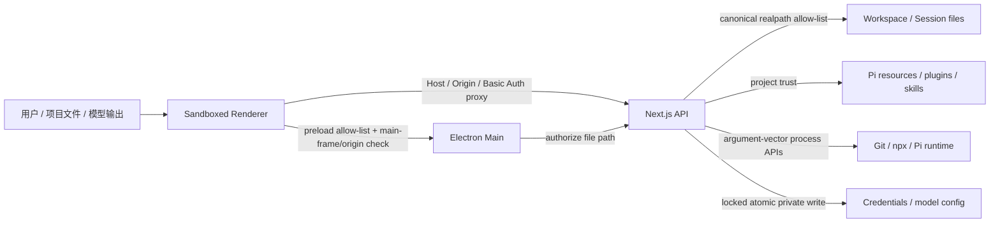

# 数字化 AI 助手项目梳理与优化报告

> 状态：T0–T6 已实施并完成本机验证  
> 日期：2026-08-09  
> 优化计划：[`tasks/plan.md`](../tasks/plan.md)  
> 执行清单：[`tasks/todo.md`](../tasks/todo.md)  
> 安全报告：[`security-scan-2026-08-09/report.md`](./security-scan-2026-08-09/report.md)

## 1. 执行摘要

本轮从健康门禁开始，随后用隔离的 Pi agent 目录、临时 Git 项目、独立 Electron profile 和固定性能夹具审计桌面助手。已完成核心用户旅程、安全边界、性能预算、垂直修复、PR CI 和 macOS arm64 发布候选验证。

结果概览：

- 修复 1 个 P0 数据完整性问题：首条消息 Fork 返回幽灵 session。
- 修复 9 类 P1/P2 可靠性、安全和体验问题：Webpack API 500、文件 watch 反馈环、服务异常退出隐藏、Skill 目录、首次使用文案、符号链接越界、Electron IPC/导航边界、非原子写入和主题路径输入。
- 将 Next、Mermaid、Undici 及传递依赖升级到修复版本；删除未使用的 `to-ico` 旧链。完整 `npm audit` 为 0。
- 建立可重复性能基准。5,000 消息 JSONL 读取 p95 约 7.27 ms，分支上下文 p95 约 1.55 ms；4.8 MB 折叠工具结果 p95 约 0.31 ms，不支持“按组件大小直接重写”的假设。
- 30 分钟固定负载完成 175,300 轮和 30 个逐分钟样本；heap 从 62.65 MiB 降至 54.26 MiB，显式 GC/空闲后为 43.77 MiB，未发现单调增长。
- macOS arm64 未签名包实际启动到可交互约 1.14 秒；最终依赖树打包后，默认端口占用时改用 62494，约 1.21 秒可交互。
- 新增 Ubuntu、Windows、macOS PR 快速矩阵，增强 Windows 动态端口 smoke，增加 macOS arm64 打包/结构/启动工作流。

## 2. Top 10 优化机会与处理结果

| 优先级 | 机会/问题 | 证据 | 投入与主要风险 | 验收结果 |
| --- | --- | --- | --- | --- |
| P0 | 空 Fork 未落盘 | UI 跳转到新 id，但 JSONL 不存在 | M；需保持 Pi v3 header/父会话语义 | 返回前以 `wx` 落盘；API/UI/删除闭环通过 |
| P0 | allow-list 内符号链接可逃逸 | 词法路径仍在根内，真实路径在根外 | M；跨 POSIX/Windows 路径规则不可混用 | 统一比较现存祖先 realpath；现存/未来子路径负测通过 |
| P1 | Electron Renderer 权限边界不完整 | 无 sandbox、导航/弹窗限制和 IPC frame/origin 校验 | M；可能影响登录、外链和 frameless 生命周期 | sandbox、严格导航/协议、webview 禁用、全部 IPC 来源校验通过 |
| P1 | `showItemInFolder` 可接受 Renderer 路径 | 主进程只检查 `existsSync` | S；服务不可用时功能应安全失败 | 服务端 `type=authorize` 后才调用系统 shell；越界负测通过 |
| P1 | Webpack dev API 500 | instrumentation 加载 Undici 失败 | S；需同时保持开发和生产构建 | server externalize `undici`；开发 API 与 Next 16.3 Webpack build 通过 |
| P1 | 文件 watch 反馈环 | 单次修改后计数增长到 11,000+ | S；去重不能吞掉真实内容变化 | `{mtimeMs,size}` 快照去重；单次修改稳定为 `+1` |
| P1 | 服务异常退出后隐藏到托盘 | exit handler 调用 `close()` 被 close handler 拦截 | S；退出路径不能误杀用户已有服务 | 显示日志/code/signal 后完整退出；生命周期测试通过 |
| P1 | 凭据/上传覆盖非原子 | 写入中断可损坏 auth 或先删旧上传 | M；需保持权限、锁与同文件系统 rename | 锁内私有原子替换与上传临时文件 rename 测试通过 |
| P1 | 易受攻击生产/开发依赖 | 初始 production audit 7 项；全树 17 项 | M；升级可能影响 Markdown、构建和打包 | 全树 audit 0；342 测试、构建与桌面 smoke 通过 |
| P2 | 缺少持续发布门禁 | 只有 tag/manual Windows workflow | M；平台结论必须由对应 runner 产生 | 三平台 PR CI、Windows 动态端口 smoke、macOS arm64 workflow 已就绪 |

投入采用相对量级：S 为单一边界的局部修复，M 为跨两层以上且需要集成/打包验证的修复。

## 3. 当前版本与参考环境

| 项目 | 值 |
| --- | --- |
| 应用 | `0.8.6-f` |
| Node.js / npm | `v22.22.3` / `10.9.8` |
| Next.js / React | `16.3.0` / `19.2.4` |
| Electron | `43.2.0` |
| Pi SDK | `0.84.0` |
| TypeScript | `5.9.3` |
| 参考机器 | Apple M4、10 logical CPU、16 GiB、macOS arm64、Darwin `25.5.0` |

开始前已有用户的 macOS 编辑快捷键改动：`electron/main.js`、`electron/mac-edit-shortcuts.js` 和对应测试。本轮保留并验证了这些改动，没有回退用户工作。

## 4. 架构与核心边界



桌面产品仍保持 loopback-only。安全响应头增加 `frame-ancestors 'none'`、`X-Frame-Options: DENY`、`nosniff`、`no-referrer` 和受限 Permissions Policy；未用 wildcard CORS 换取 LAN 便利。

## 5. 核心用户旅程结论

### 5.1 启动与生命周期

- 既有服务、自有服务、默认端口占用、单实例、托盘隐藏/恢复、完整退出均已验证。
- 自有服务异常退出会显示 server log 路径、末尾输出、code/signal，再退出；不会留下不可用托盘进程。
- Renderer `render-process-gone`、`did-fail-load` 和 console error 保留原因、退出码和 URL。
- 生产 macOS 包固定端口路径约 1.14 秒可交互；最终依赖树打包后，占用 30141 会自动选择 62494，约 1.21 秒可交互。

### 5.2 项目、会话与 Worktree

- cwd 验证、最近工作区恢复、草稿隔离、重命名、删除、导出、Worktree 脏目录 409/force 恢复通过。
- Fork 必须满足“新 id 对应真实 JSONL、parent id 正确、侧栏出现、可删除”，修复后完整闭环。
- 会话内分支保持同文件树语义，不与 Fork 的独立 JSONL 混淆。
- 新会话 cwd 和所有文件 API 都按真实路径授权，符号链接不能把会话或读写重定向到根外。

### 5.3 Agent run 与流恢复

- 自动测试覆盖 prompt、图片、`@file`、Thinking、工具、compaction、abort、steer/follow-up、SSE idle grace、连接去重、旧 run 丢弃和最终 flush。
- 流式调度上限保持 30 次 React 更新/秒；100,000 次同步 enqueue 合并为一次提交，p95 约 1.41 ms。
- 旧 run 的排队更新不能写入新 run；结束时最终快照立即 flush，不留幽灵气泡。
- 未使用真实 provider 凭据，因此本轮没有对外发送模型内容；真实网络中断和 OAuth/API Key 人工 smoke 仍需用户提供测试账号授权。

### 5.4 文件、设置与资源

- 文件索引、搜索、预览、Markdown 本地资源、Git diff、拖入、上传限制和 Worktree 路径边界已覆盖。
- 文件 watch 的重复系统事件不会重复增加 UI 变化计数。
- HTTP 主题接口拒绝路径型名称和未授权 `cwd`，SDK 内部直接主题路径能力保持不变。
- API Key/OAuth 状态接口不返回原始 key；OAuth 手工回调 token 改用 `randomUUID()`。
- bundled skills 尊重 `PI_CODING_AGENT_DIR`；项目扩展、Prompt、Skills 和包资源仍经过 project-trust。

## 6. 安全、隐私与数据完整性

安全扫描覆盖 Electron、HTTP、文件、凭据、内容渲染、进程执行和依赖面。规范 JSON、SARIF 和 Markdown 报告位于 [`docs/security-scan-2026-08-09/`](./security-scan-2026-08-09/)。扫描后的当前工作树未保留未修复发现。

关键负向测试：

- allow-list 根内的符号链接指向根外时，现有文件和尚未创建的后代均拒绝。
- Renderer URL 必须与应用 exact origin 相同；外部只允许 HTTP(S)，其他协议拒绝。
- 主题名中的 `/`、`\\`、NUL、`.`/`..` 拒绝。
- 目录、符号链接不能被上传覆盖；已有文件采用原子替换。
- Credential 删除要求 provider 与 credential type 同时匹配，锁被破坏时不继续写。
- `npm audit`（含开发依赖）为 0 vulnerabilities。

可观测性决策：本轮不接入 Langfuse。理由是当前问题可用本地结构化指标定位，引入外部 tracing 会扩大 prompt、工具参数、绝对路径和模型输出的隐私面。若未来接入，必须 opt-in、服务端持钥、默认字段脱敏、离线/fail-open，退出 flush 设置硬上限。

## 7. 性能基线与预算

详细脚本：`npm run benchmark:desktop`；固定夹具和完整数据见 [`desktop-performance-baseline-2026-08-09.md`](./desktop-performance-baseline-2026-08-09.md)。

| 场景 | 夹具 | p50 | p95 | 结论 |
| --- | --- | ---: | ---: | --- |
| 典型上下文 | 200 messages | 0.08 ms | 0.09 ms | 非瓶颈 |
| 长上下文 | 5,000 messages，defer thinking/image | 0.90 ms | 4.08 ms | 非瓶颈 |
| 分支切换 | 2,500-message leaf | 0.50 ms | 1.55 ms | 非瓶颈 |
| JSONL 读取 | 5,000 messages | 5.32 ms | 7.27 ms | 非瓶颈 |
| 完整 Markdown 初次渲染 | 80 sections | 53.40 ms | 84.95 ms | 需要预算保护 |
| streaming Markdown 初次渲染 | 80 sections | 85.56 ms | 144.27 ms | 冷初次渲染上界；稳态由 stable-part memo 保护 |
| 大工具结果折叠 | 4.8 MB text | 0.19 ms | 0.31 ms | 现有预览截断有效 |
| 文件索引构建 | 50,000 files | 52.66 ms | 55.32 ms | 可接受，避免同步频繁重建 |
| 文件搜索 | 50,000 entries | 9.66 ms | 10.44 ms | 可接受 |
| Git status | 1,000 files / 100 dirty | 20.08 ms | 37.45 ms | 可接受 |

Electron 开发态首轮到可交互约 9.19 秒，热缓存约 7.28 秒；主要时间在 dev server ready 和页面导航。生产包约 1.14 秒，说明开发编译耗时不应误判为产品冷启动回归。生产初始 Renderer 的 Chromium 指标：JS heap 约 16.4 MiB、ScriptDuration 121 ms、LayoutDuration 33 ms、115 个 DOM 节点。

30 分钟固定负载完成 175,300 轮上下文构建和 30 个逐分钟样本。RSS 首值/末值/峰值为 173.66/62.98/173.66 MiB，期间 13 次上升、15 次下降；heap 首值/末值/峰值为 62.65/54.26/62.65 MiB。停止负载、显式 GC 并空闲 5 秒后 RSS 为 84.88 MiB、heap 为 43.77 MiB、external 为 3.81 MiB：均低于首样本/峰值，且不存在持续单调增长，本轮稳定性预算通过。

冻结预算：

- 同一参考机/夹具 p50 或 p95 不得回退超过 10%。
- 5,000-message JSONL 读取 p95 目标不超过 10 ms。
- 50,000-file 搜索 p95 目标不超过 15 ms；构建不超过 65 ms。
- 80-section streaming 初次渲染 p95 目标不超过 160 ms；流式稳态继续限制 30 commits/s。
- macOS arm64 生产包到两帧后可交互目标不超过 1.5 秒（本地无签名目录包、空 profile）。
- 30 分钟固定负载停止后强制 GC/空闲 5 秒，heap 应回到稳定范围，不继续单调增长。

SSR 初次渲染不能代表 React memo 后的每-token 更新。本轮同时检查了 stable-part interning、`React.memo` 和流式 scheduler；没有证据支持拆分 `ChatInput`、`SessionSidebar` 或重写 `useAgentSession` 来“提升性能”。

## 8. 垂直切片完成情况

| 切片 | 结果 | 回滚边界 |
| --- | --- | --- |
| 1 门禁/文档 | 测试选择、realpath 测试、Lint、版本同步 | 测试/文档独立回退 |
| 2 启动/IPC | 服务退出诊断、sandbox、导航、IPC、路径授权 | Electron 与安全 helper 独立回退 |
| 3 聊天恢复 | 保留 run id、reconciliation、scheduler；Fork 落盘修复 | RPC/Fork 独立回退 |
| 4 工作区/文件 | watch 去重、canonical path、上传原子替换、主题 cwd | 文件 API/helper 独立回退 |
| 5 长会话/渲染 | 基准证明上下文/大结果不是瓶颈；未做无证据重写 | 仅新增基准，无 UI 重构 |
| 6 设置/资源 | Skill 目录、凭据原子写、OAuth token、trust 复核 | Auth/Skill 变更分离 |
| 7 最小架构拆分 | 只抽离 `new-session-cwd`、安全/主题/原子 helper | 单用途 helper 可单独回退 |
| 8 可观测性 | 本地 opt-in Electron/Chromium 指标；Langfuse 暂缓 | 删除 benchmark 开关即可 |

## 9. CI 与发布质量

- `.github/workflows/quality.yml`：Ubuntu 24.04、Windows 2025、macOS 15，统一执行 `npm ci`、源码测试、TypeScript、Lint、diff check。
- `.github/workflows/windows-x64.yml`：保留 x64 dir/NSIS/portable 构建和固定端口 smoke；新增占用 30141 后从日志发现动态端口并请求 `/api/home`。
- `.github/workflows/macos-arm64.yml`：手动生成未签名 arm64 dir 包，验证 Mach-O 架构、Next/Pi/Undici/runtime/bundled skills，再实际启动到 `renderer-interactive`。
- 本机完成 Next 16.3 Webpack production build、macOS arm64 package verifier、固定/动态端口实际启动。
- macOS arm64 `.app` 解压目录约 832 MiB；未生成 DMG，因此不把安装包压缩体积写成已测结果。
- Windows workflow 已完成本地 YAML、脚本和夹具测试，但本机不是 Windows，实际 PE 包与 GitHub runner smoke 必须以远端 workflow 结果为准。

Next 16.3 暴露并修复两个发布兼容点：生产构建需显式 `--webpack`；Route Handler 不允许导出任意测试 helper，因此 cwd 校验迁移到 `lib/new-session-cwd.ts`。

## 10. 最终验证与已知限制

固定门禁：

```bash
npm test
node_modules/.bin/tsc --noEmit
npm run lint
git diff --check
npm audit --registry=https://registry.npmjs.org
```

发布验证：

```bash
npm run build
npx electron-builder --mac dir --arm64 --publish never
node scripts/verify-macos-package.mjs
npm run benchmark:desktop
```

最终本机结果：源码测试 `342/342` 通过；TypeScript、Lint、diff check 和完整依赖审计通过，审计为 `0 vulnerabilities`；Next production build、macOS arm64 包结构验证以及固定/动态端口启动 smoke 均通过。三份 GitHub Actions workflow 也已完成 YAML 语法校验。

已知限制：

- 真实 provider prompt、网络中断、OAuth/API Key 和外部上传未执行，因为本轮没有得到可用于测试的真实凭据或外部传输授权；相关本地边界与状态机由自动测试覆盖。
- Windows x64 实际打包只能由 Windows workflow 完成；本机验证了生成/校验脚本和 workflow 逻辑，未声称在 macOS 上执行了 Windows 应用。
- `MODULE_TYPELESS_PACKAGE_JSON` 仍会出现在少量 Jiti 测试。根项目混合 Electron CommonJS 与 ESM，不为消除非阻断警告全局设置 `type: module`。
- `@lobehub/ui` 下的 `@emoji-mart/react` 仍声明 React 16–18 peer range，安装时会提示与 React 19 的 peer warning；当前测试、生产构建和桌面 smoke 均通过，保持为上游兼容性观察项。

## 11. Now / Next / Later

### Now（已完成）

- 数据完整性、安全边界、依赖修复、性能基线、PR CI、macOS 发布候选。
- 保持 Electron-first UI、主题、字体、流程时间线和高冲突组件架构。

### Next（需要外部平台或凭据）

- 运行 GitHub `Quality`、`Windows x64`、`macOS arm64` workflow 并保存远端 run 链接。
- 使用专用测试 provider 完成真实 SSE 中断恢复、abort、steer/follow-up、OAuth 取消和 API Key 生命周期。
- 在真实 Windows 机器人工检查 frameless 窗口控件、托盘、文件管理器定位和输入法。

### Later（有数据再做）

- 若 80-section streaming 初次渲染越过 160 ms，再用 React Profiler 定位具体 Markdown block；不先拆大组件。
- 若 50,000-file 搜索频率造成输入延迟，再考虑 Worker 或增量索引。
- 只有在隐私评审和明确运营需求成立后才接入 Langfuse。

## 12. 相关文档

- [架构与核心流程](./architecture-and-core-flows.zh-CN.md)
- [Langfuse 接入计划](./langfuse-integration-plan.zh-CN.md)
- [Langfuse 参考实现对照](./langfuse-reference-codex-workspace-bot.zh-CN.md)
- [最近一次上游同步记录](./2026-08-08-232540.md)
- [Windows GitHub 构建说明](./github-build-windows.md)
