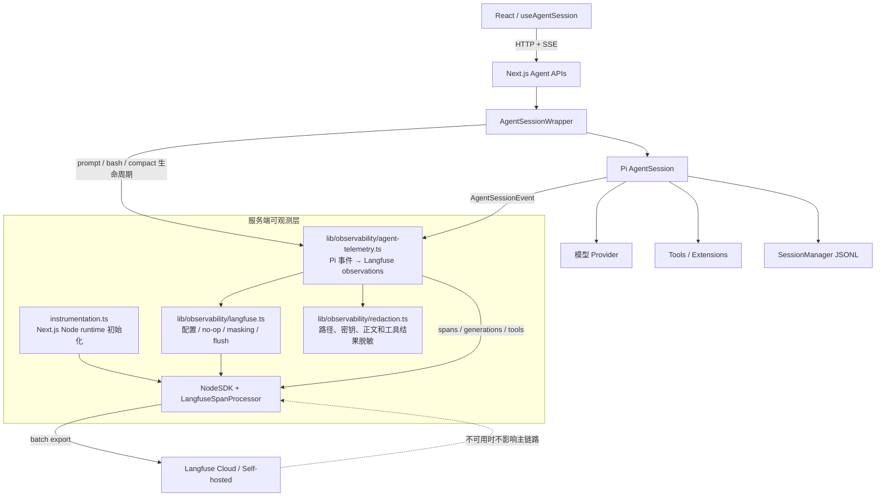

# Langfuse 接入实施计划

> 状态：规划稿，尚未实施  
> 适用项目：数字化AI助手（Pi Web Desktop）  
> 编写日期：2026-08-07  
> 目标 SDK：Langfuse JS/TS SDK v5（OpenTelemetry-based）

## 1. 背景与目标

Pi Web Desktop 当前已经具备比较完整的本地 Agent 运行链路：

```text
React 客户端
  → Next.js Agent API
  → AgentSessionWrapper
  → Pi AgentSession
  → 模型 Provider / 工具
  → SessionManager JSONL
```

系统内部可以看到流式消息、工具执行、模型、token、cost、自动重试、compaction 和错误，但这些信息主要存在于：

- 当前 React 页面状态；
- Pi SDK 事件；
- 本地 JSONL 会话文件；
- Electron 的 `pi-web-server.log`；
- 临时控制台日志。

缺少一个跨会话、跨模型、跨版本的统一可观测平台，因此计划接入 Langfuse，用于回答以下问题：

1. 一次用户请求经历了哪些模型调用和工具调用？
2. 每个 Agent turn 的首 token、总耗时、工具耗时分别是多少？
3. 不同 provider / model 的成功率、重试率、token 和成本如何？
4. 哪些工具最常用、最慢、最容易失败？
5. compaction、extension、SSE 恢复是否与失败或高延迟相关？
6. 某个桌面版本或 Pi SDK 版本是否引入了质量或稳定性回归？
7. 一个多轮 Pi session 的完整执行轨迹是什么？

### 1.1 第一阶段成功标准

第一阶段接入完成后，应满足：

- 每个用户 prompt 在 Langfuse 中产生一个独立 trace/root observation。
- 同一个 Pi JSONL 会话的多轮 prompt 使用同一个 Langfuse `sessionId`。
- 一次 prompt 中的模型 turn、工具调用、retry、compaction 和错误能够关联到同一个 trace。
- Generation 至少记录 provider、model、输入/输出 token、cache token、cost 和 stop reason。
- Tool observation 至少记录工具名、耗时、成功/失败和安全摘要。
- Langfuse 不可达、密钥无效或 exporter 报错时，聊天、SSE、工具和 JSONL 持久化仍正常工作。
- 默认不上传 API Key、认证头、完整项目路径、完整文件内容、图片 base64、完整 bash 输出和完整系统提示词。
- Electron 退出和服务进程结束时尽可能 flush 已完成的 telemetry。

### 1.2 非目标

本计划第一阶段不包含：

- 在 React Renderer 中初始化 Langfuse SDK。
- 将 Langfuse Public/Secret Key 暴露给浏览器。
- 用 Langfuse Prompt Management 替换 Pi 的 system prompt、prompt templates 或 skills。
- 用 Langfuse 替代 Pi JSONL 会话持久化。
- 将 Langfuse 作为应用运行的强依赖。
- 自动采集所有 Next.js HTTP 请求和所有文件系统操作。
- 上传完整代码仓库、完整聊天正文或原始图片。
- 第一阶段直接对 Pi SDK provider adapters 做大范围侵入式修改。

## 2. 关键设计决策

### 2.1 仅服务端接入

Langfuse SDK 只运行在 Next.js Node.js 服务进程中：

```text
Electron main process
    └── fork Next.js Node process
            └── Langfuse / OpenTelemetry SDK
```

不在以下位置初始化：

- React 客户端；
- `electron/preload.js`；
- BrowserWindow Renderer；
- 公开的 API response；
- `NEXT_PUBLIC_*` 环境变量。

原因：Langfuse Secret Key 属于服务端凭据，而本项目的 AgentSession、模型和工具本来就在 Next.js Node 进程内运行。

### 2.2 以一个 prompt 为一个 trace

推荐映射：

```text
Pi session                 → Langfuse sessionId
一次 prompt / slash run     → 一个 Langfuse trace/root span
每一次模型 turn             → generation observation
每一个 tool call            → tool observation
compaction / retry / reload → span 或 event observation
```

不建议将整个 Pi session 做成一个永不结束的 trace。原因：

- Pi session 可能持续数天或数周；
- Langfuse trace 更适合一次完整执行；
- 每个 turn 独立后，更容易统计延迟、成本和成功率；
- 仍可通过稳定的 `sessionId` 在 Langfuse 中回放多轮会话。

### 2.3 使用 Pi session id 作为 Langfuse sessionId

建议：

```text
Langfuse sessionId = Pi AgentSession.sessionId
```

优势：

- 与 JSONL header id 一致；
- 不需要额外持久化映射；
- Fork 后自然生成新的 Langfuse session；
- 可以从本地 session id 反查 Langfuse session。

不发送 `sessionFile` 绝对路径。

### 2.4 Trace 根节点放在 AgentSessionWrapper

推荐在 `AgentSessionWrapper.send({ type: "prompt" })` 创建 root observation，而不是只在 Route Handler 创建。

原因：

- HTTP POST 是 fire-and-forget，Route Handler 会早于 Agent 执行完成返回；
- 同一个 prompt 的生命周期跨越 `prompt()` Promise、SDK event subscription 和 SSE；
- steer/follow-up/extension 也可能触发后续 Agent run；
- `AgentSessionWrapper` 能看到 session id、cwd、model、thinking、工具、事件和结束状态。

Route Handler 只负责传入请求级元数据，例如 run id 或入口类型；trace 的开始和结束由 wrapper 管理。

### 2.5 显式状态机优于依赖隐式 async context

Pi SDK 事件通过 `inner.subscribe()` 回调到达。虽然 OpenTelemetry 可以传播大多数 Promise async context，但长生命周期事件订阅、队列和 extension 触发的 run 不应完全依赖隐式 context。

建议每个 wrapper 显式维护 telemetry run state：

```typescript
type ActiveTelemetryRun = {
  runId: string;
  root: LangfuseObservationHandle;
  startedAt: number;
  firstTokenAt?: number;
  generation?: LangfuseObservationHandle;
  tools: Map<string, LangfuseObservationHandle>;
  completedMessageIds: Set<string>;
};
```

实际类型应封装在项目自己的 adapter 中，不让 `rpc-manager.ts` 直接依赖大量 Langfuse 类型。

### 2.6 可观测性必须 fail-open

所有 telemetry API 都必须满足：

```text
Langfuse 成功    → 发送 trace
Langfuse 失败    → 本地功能继续运行
Langfuse 未配置  → 使用 no-op adapter
Langfuse 超时    → 不阻塞 Agent 和 HTTP response
```

禁止：

- 因 exporter 异常让 prompt 失败；
- 等待 Langfuse 网络请求后才发送 SSE；
- 因 flush 卡住 Electron 退出；
- 因 telemetry 序列化失败中断工具执行。

## 3. 推荐目标架构



## 4. Langfuse 数据模型映射

### 4.1 层级映射

建议的 observation tree：

```text
trace/root: pi.prompt
├── span: pi.session.ensure               可选，仅新会话
├── generation: pi.model.turn.1
├── tool: pi.tool.read
├── tool: pi.tool.grep
├── generation: pi.model.turn.2
├── span/event: pi.retry                  发生重试时
├── span: pi.compaction                   发生压缩时
└── event/span: pi.prompt.result
```

对于 slash command：

```text
trace/root: pi.command
├── span: pi.command.reload
├── span: pi.command.compact
└── span: pi.extension.command
```

对于直接 bash：

```text
trace/root: pi.bash
└── tool: pi.tool.bash
```

第一阶段可优先完成 `pi.prompt`，bash、compact 和 reload 作为后续增量。

### 4.2 Trace/root observation 字段

| Langfuse 字段 | 建议值 | 说明 |
| --- | --- | --- |
| `name` | `pi.prompt` | 普通用户消息 |
| `sessionId` | Pi session id | 多轮会话关联 |
| `userId` | 默认不设置 | 本地单用户产品不应发送系统用户名 |
| `version` | 服务端 app version | 如 `0.7.16` |
| `environment` | `development` / `desktop` / `web` / `ci` | 由环境变量明确配置 |
| `tags` | `desktop`、`web`、`new-session`、`slash-command`、`has-images` | 仅低基数标签 |
| `input` | 默认只记录摘要 | 长度、图片数量、命令类型，可选正文 |
| `output` | 最终状态摘要 | 成功、失败、abort、最终文本长度 |
| `metadata` | 见下表 | 禁止凭据与原始绝对路径 |

推荐 metadata：

```json
{
  "appVersion": "0.7.16",
  "piVersion": "0.83.0",
  "runtime": "electron",
  "platform": "win32",
  "arch": "x64",
  "provider": "example-provider",
  "modelId": "example-model",
  "thinkingLevel": "high",
  "toolPreset": "default",
  "projectId": "sha256:REDACTED",
  "worktree": true,
  "streamingBehavior": "normal"
}
```

注意：

- `projectId` 使用本地规范化 project root 的盐化 hash，不发送原始路径。
- 不将 branch 名默认作为 tag，避免高基数和潜在敏感信息；需要时可放入经清洗 metadata。
- 不发送 `sessionFile`。

### 4.3 Generation 字段

每次模型 turn 建立一个 `generation` observation。

建议字段：

| 字段 | 来源 |
| --- | --- |
| `name` | `pi.model.turn` |
| `model` | assistant message 的 `provider/model` 或 active model |
| `input` | 默认摘要；可选最近用户消息和上下文统计 |
| `output` | 默认摘要；可选最终 assistant 文本 |
| `usageDetails.input` | `message.usage.input` |
| `usageDetails.output` | `message.usage.output` |
| `usageDetails.cacheRead` | `message.usage.cacheRead`，若当前 Langfuse 自定义 usage key 支持则使用 |
| `usageDetails.cacheWrite` | `message.usage.cacheWrite` |
| `costDetails` | SDK v5 类型确认后映射 Pi cost 明细 |
| metadata `stopReason` | `message.stopReason` |
| metadata `thinkingLevel` | wrapper 当前 thinking level |
| metadata `retryAttempt` | 当前 retry attempt |

Pi UI 类型已包含：

```typescript
usage: {
  input: number;
  output: number;
  cacheRead: number;
  cacheWrite: number;
  cost: {
    input: number;
    output: number;
    cacheRead: number;
    cacheWrite: number;
    total: number;
  };
}
```

实现时应以安装后的 Langfuse v5 TypeScript 类型为准确认 `costDetails` 和自定义 usage key 的精确形式，不在计划阶段硬编码未经编译验证的属性名。

### 4.4 Tool observation 字段

工具开始事件提供：

```typescript
{
  type: "tool_execution_start";
  toolCallId: string;
  toolName: string;
  args: unknown;
}
```

工具结束事件提供：

```typescript
{
  type: "tool_execution_end";
  toolCallId: string;
  toolName: string;
  result: unknown;
  isError: boolean;
}
```

建议映射：

| 字段 | 内容 |
| --- | --- |
| observation type | `tool` |
| name | `pi.tool.<toolName>` |
| input | 经过工具专用 redactor 的参数摘要 |
| output | 结果摘要，不是完整内容 |
| metadata `toolCallId` | tool call id |
| metadata `isError` | 是否失败 |
| metadata `durationMs` | observation 自带 duration，必要时额外记录 |

工具脱敏策略见第 6 节。

### 4.5 Retry、compaction 和 extension

建议：

| Pi 事件 | Langfuse 映射 |
| --- | --- |
| `auto_retry_start` | event 或 span `pi.model.retry`，记录 attempt、delay 和脱敏错误分类 |
| `auto_retry_end` | 更新 retry span：success / final error category |
| `compaction_start` | span `pi.compaction` |
| `compaction_end` | 更新 token before/after、reason、aborted、willRetry |
| `summarization_retry_*` | `pi.summarization.retry` event/span |
| `extension_error` | root 下 error event/span |
| `extension_ui_request` | 默认只记录 method，不记录用户输入和 widget 内容 |
| `queue_update` | 默认不逐次记录，只在 root 结束时记录队列统计 |

## 5. 插桩位置与代码改动计划

### 5.1 新增依赖

计划增加：

```bash
npm install @langfuse/tracing @langfuse/otel @opentelemetry/sdk-node
```

可选：

```bash
npm install @langfuse/client
```

第一阶段如果只做 tracing，不需要 `@langfuse/client`。仅当后续需要 score、dataset、prompt management 或查询 API 时再增加。

Langfuse JS/TS v5 的服务端最低要求为 Node.js 20；本项目要求 Node.js `>=22.19.0`，满足要求。

### 5.2 新增 `instrumentation.ts`

在仓库根目录创建：

```typescript
export async function register() {
  if (process.env.NEXT_RUNTIME !== "nodejs") return;
  await import("./lib/observability/instrumentation-node");
}
```

职责：

- 利用 Next.js instrumentation hook 在 Node server 启动时初始化一次 telemetry。
- 避免在 Edge runtime 导入 Node SDK。
- 不在顶层静态导入 Node-only OpenTelemetry 包。

Next.js 会在每个新服务实例启动时调用一次 `register()`，并在开始处理请求前等待它完成。

### 5.3 新增 `lib/observability/instrumentation-node.ts`

职责：

- 读取 Langfuse 环境变量。
- 未启用或配置不完整时直接安装 no-op 状态。
- 创建一个 `LangfuseSpanProcessor`。
- 配置 masking。
- 配置 sampling。
- 启动 `NodeSDK`。
- 将 SDK 和 processor 存放在 `globalThis`，避免 Next.js dev hot reload 重复初始化。
- 暴露 `forceFlush()` 和 `shutdown()`。

建议全局状态：

```typescript
declare global {
  var __piTelemetryState: TelemetryState | undefined;
}
```

状态建议：

```typescript
type TelemetryState =
  | { status: "disabled"; reason: string }
  | {
      status: "enabled";
      sdk: NodeSDK;
      processor: LangfuseSpanProcessor;
      startedAt: number;
    };
```

注意：OpenTelemetry 全局 provider 通常不能安全地重复注册，因此 hot reload 保护属于必须项。

### 5.4 新增 `lib/observability/config.ts`

集中解析配置，禁止在业务代码到处读取 `process.env`。

建议配置类型：

```typescript
interface ObservabilityConfig {
  enabled: boolean;
  publicKey?: string;
  secretKey?: string;
  baseUrl: string;
  environment: string;
  sampleRate: number;
  captureContent: "none" | "metadata" | "full";
  captureToolContent: boolean;
  flushTimeoutMs: number;
}
```

解析规则：

- 默认关闭，只有 `PI_WEB_LANGFUSE_ENABLED=1` 才启用。
- 开启后缺少 public/secret key 时记录一次配置警告并降级关闭。
- `sampleRate` 限制在 `0..1`。
- production 默认 `captureContent=metadata`。
- `full` 必须显式配置。
- base URL 支持 Cloud 区域和 self-hosted。

### 5.5 新增 `lib/observability/redaction.ts`

职责：

- 深度限制和大小限制。
- 移除 key、token、authorization、cookie、password 等字段。
- 移除 base64 图片。
- 将绝对路径转为相对路径或 hash。
- 为不同工具生成安全摘要。
- 限制错误堆栈和输出长度。

建议 API：

```typescript
export function redactTraceInput(input: unknown, policy: CapturePolicy): unknown;
export function redactTraceOutput(output: unknown, policy: CapturePolicy): unknown;
export function redactToolInput(toolName: string, input: unknown): unknown;
export function redactToolOutput(toolName: string, output: unknown): unknown;
export function sanitizeMetadata(metadata: Record<string, unknown>): Record<string, unknown>;
export function hashProjectPath(path: string): string;
```

### 5.6 新增 `lib/observability/langfuse.ts`

作为 Langfuse v5 的薄 adapter，业务代码不直接导入 `@langfuse/tracing`。

建议暴露：

```typescript
export interface ObservationHandle {
  update(data: Record<string, unknown>): void;
  end(): void;
}

export function isTelemetryEnabled(): boolean;
export function startRootObservation(...): ObservationHandle;
export function startChildObservation(...): ObservationHandle;
export function runWithTraceAttributes<T>(...): Promise<T>;
export function forceFlushTelemetry(timeoutMs?: number): Promise<void>;
export function shutdownTelemetry(timeoutMs?: number): Promise<void>;
```

adapter 内部负责：

- Langfuse v5 精确类型和属性名。
- try/catch。
- no-op handle。
- observation 重复 end 保护。
- 大 payload 截断。
- SDK 未初始化时降级。

### 5.7 新增 `lib/observability/agent-telemetry.ts`

这是 Pi 事件到 Langfuse 数据模型的适配器。

建议类：

```typescript
export class AgentTelemetry {
  beginPrompt(context: PromptTraceContext): string;
  handleAgentEvent(runId: string, event: AgentSessionEvent): void;
  finishPrompt(runId: string, result: PromptResult): void;
  failPrompt(runId: string, error: unknown): void;
  abandonAll(reason: string): void;
}
```

需要处理：

- 同一个 wrapper 同时最多一个普通 prompt run；
- steer/follow-up 队列；
- 一个 prompt 内多个 model turn；
- 并行 tool call；
- retry 前后的 generation 边界；
- prompt_error 与 agent_end 的顺序；
- wrapper shutdown 时未完成 observations 的清理；
- late event 和重复 end 的幂等性。

### 5.8 修改 `lib/rpc-manager.ts`

这是主要插桩点，但修改应保持局部。

计划修改：

1. `AgentSessionWrapper` 增加一个 `AgentTelemetry` 实例。
2. `send("prompt")` 开始 root observation。
3. 调用 `inner.prompt()` 前记录：
   - session id；
   - model；
   - thinking level；
   - streaming behavior；
   - 图片数量；
   - 激活工具数量；
   - cwd 的 hash。
4. `inner.subscribe()` 中把事件交给 telemetry adapter。
5. `prompt().then()` / `.catch()` 中完成或失败 root observation。
6. `destroy()` / `shutdown()` 时终止未完成 observations。
7. `set_model`、`set_thinking_level` 只更新后续 trace metadata，不产生独立 trace。
8. `fork` trace 记录 `forked=true` 和目标新 session id，但不记录文件路径。

不建议直接把 Langfuse 逻辑写进现有事件 switch；应保持：

```typescript
this.telemetry.handleEvent(event);
this.emit(event);
```

### 5.9 修改模型测试接口

[`app/api/models-config/test/route.ts`](../app/api/models-config/test/route.ts) 直接调用 `completeSimple()`，不会经过 AgentSession。

建议第二阶段单独记录：

```text
trace: pi.model.test
└── generation: pi.model.test.call
```

字段：

- provider；
- model id；
- latency；
- HTTP status；
- 成功/失败；
- 不记录 API key；
- 默认不记录测试 response 正文。

该接口不能与正式 Agent prompt trace 混在一起，避免污染产品质量统计。

### 5.10 修改进程退出流程

当前 Electron 通过 `serverProcess.kill()` 终止 Next.js 子进程。若直接发送终止信号，尚未导出的 batch spans 可能丢失。

计划分两步：

#### 最小方案

在 Next.js telemetry 初始化模块注册一次：

```text
SIGINT / SIGTERM
    → 带超时调用 shutdownTelemetry()
    → 退出进程
```

必须避免与 `rpc-manager.ts` 已有 signal handler 重复调用 `process.exit()` 产生竞态。更稳妥的方式是新增统一的服务端 shutdown coordinator。

#### 推荐方案

新增 `lib/server-shutdown.ts`：

```typescript
registerServerShutdownHook("rpc-sessions", shutdownAllRpcSessions);
registerServerShutdownHook("telemetry", shutdownTelemetry);
```

收到 SIGINT/SIGTERM 时：

1. 标记 shutting down；
2. 停止接受新的 telemetry run；
3. shutdown 所有 AgentSession；
4. flush/shutdown Langfuse，设置 2～5 秒超时；
5. 按原 signal code 退出。

Electron `before-quit` 可先向 child 发送 SIGTERM，并在超时后强制 kill。Windows 下需验证 Electron child process 的实际 signal 行为；如果不可靠，可增加本地 shutdown IPC/HTTP endpoint，但该 endpoint 必须限制为 Electron 本地进程使用，不能成为公开管理接口。

## 6. 数据隐私与脱敏策略

该项目处理源代码、shell 命令、文件内容、API 凭据和对话上下文。Langfuse 接入的默认策略必须是最小采集。

### 6.1 采集等级

建议提供三档：

| 配置 | 行为 |
| --- | --- |
| `none` | 只发送耗时、状态、model、token、cost、工具名，不发送正文 |
| `metadata` | 默认；发送字符数、内容类型、路径类别和脱敏摘要 |
| `full` | 显式 opt-in；发送经过通用 masking 的 prompt/output，但仍不发送密钥和 base64 |

建议默认：

```text
开发环境：metadata
正式桌面包：metadata
CI：none
```

### 6.2 永不采集的数据

无论何种等级，都不发送：

- `LANGFUSE_SECRET_KEY`、`LANGFUSE_PUBLIC_KEY`；
- 任意 provider API key；
- `Authorization`、Cookie、Basic Auth；
- `auth.json` 原文；
- `.env*` 内容；
- SSH private key、PEM、证书和签名密码；
- 图片 base64；
- `fullOutputPath` 指向的完整 bash 输出文件；
- Electron BrowserWindow 中的本地 Basic Auth 密码；
- 用户 home 目录绝对路径。

### 6.3 工具专用脱敏

#### `read`

记录：

```json
{
  "path": "relative/or/hashed/path",
  "offset": 120,
  "limit": 80,
  "resultBytes": 6400
}
```

不记录完整文件内容。

#### `write` / `edit`

记录：

```json
{
  "path": "relative/or/hashed/path",
  "operation": "write",
  "inputBytes": 1200,
  "success": true
}
```

默认不记录 `content`、`old_string` 和 `new_string`。

#### `grep` / `find` / `ls`

可记录：

- 查询字符串的 hash 或有限长度脱敏文本；
- 搜索根目录类别；
- 命中数；
- 结果字节数；
- 是否截断。

#### `bash`

默认记录：

```json
{
  "commandCategory": "git|npm|test|build|other",
  "commandHash": "sha256:REDACTED",
  "exitCode": 0,
  "cancelled": false,
  "truncated": false,
  "outputBytes": 4200
}
```

默认不记录完整 command 和 output。即使启用 `full`，也应先移除：

- 环境变量赋值；
- token 参数；
- URL credentials；
- Authorization headers；
- 常见密钥格式。

#### Extension tools

未知工具使用通用结构化 redactor：

- 最大深度；
- 最大数组长度；
- 最大字符串长度；
- 敏感 key 黑名单；
- base64 检测；
- 循环引用保护。

### 6.4 Langfuse processor masking

除项目侧 redactor 外，再在 `LangfuseSpanProcessor` 配置 `mask` 回调作为第二道防线。

processor masking 会在 observation 的 `input`、`output` 和 `metadata` 发送到 Langfuse 前执行。

双层策略：

```text
业务语义 redactor
    ↓
LangfuseSpanProcessor mask
    ↓
网络发送
```

mask callback 必须是同步、快速和无异常的，避免阻塞 batch processor。

### 6.5 用户身份

这是本地单用户桌面应用，默认不要将以下内容作为 Langfuse `userId`：

- OS 用户名；
- home 路径；
- Git email；
- provider 账号。

如果未来需要跨设备用户分析，应由产品明确设计一个匿名 installation id，并提供告知、关闭和重置能力，不应在本次接入中顺带加入。

## 7. 配置与环境变量

推荐新增：

| 环境变量 | 默认值 | 说明 |
| --- | --- | --- |
| `PI_WEB_LANGFUSE_ENABLED` | `0` | 总开关 |
| `LANGFUSE_PUBLIC_KEY` | 无 | Langfuse project public key |
| `LANGFUSE_SECRET_KEY` | 无 | Langfuse project secret key |
| `LANGFUSE_BASE_URL` | `https://cloud.langfuse.com` | Cloud 区域或 self-hosted URL |
| `LANGFUSE_TRACING_ENVIRONMENT` | `default` | Langfuse environment |
| `PI_WEB_LANGFUSE_SAMPLE_RATE` | `1` | trace 采样率，范围 `0..1` |
| `PI_WEB_LANGFUSE_CAPTURE_CONTENT` | `metadata` | `none` / `metadata` / `full` |
| `PI_WEB_LANGFUSE_CAPTURE_TOOL_CONTENT` | `0` | 是否允许工具正文进入进一步 redaction |
| `PI_WEB_LANGFUSE_FLUSH_TIMEOUT_MS` | `3000` | 退出 flush 超时 |

示例：

```dotenv
PI_WEB_LANGFUSE_ENABLED=1
LANGFUSE_PUBLIC_KEY=pk-lf-REDACTED
LANGFUSE_SECRET_KEY=sk-lf-REDACTED
LANGFUSE_BASE_URL=https://cloud.langfuse.com
LANGFUSE_TRACING_ENVIRONMENT=desktop-dev
PI_WEB_LANGFUSE_SAMPLE_RATE=1
PI_WEB_LANGFUSE_CAPTURE_CONTENT=metadata
```

Self-hosted：

```dotenv
LANGFUSE_BASE_URL=https://langfuse.example.internal
```

注意：

- `.env*` 已被 Git 忽略，不应提交真实凭据。
- 不新增任何 `NEXT_PUBLIC_LANGFUSE_*`。
- Electron 当前会把绝大多数环境变量传给 Next.js child，因此 Langfuse server env 会自然进入服务进程。
- 不需要把这些值暴露给 Chromium。

## 8. Sampling、环境和版本

### 8.1 Sampling

Langfuse JS/TS v5 基于 OpenTelemetry。采样建议使用 `TraceIdRatioBasedSampler` 在 NodeSDK 初始化时决定。

规则：

- sampling 是 trace 级别；
- 被保留的 trace 包含全部 child observations；
- 被丢弃的 trace 不发送任何 child observations；
- 采样器必须在创建 spans 前初始化。

建议：

| 环境 | sample rate |
| --- | --- |
| 本地开发验证 | `1.0` |
| 内部测试 | `1.0` |
| 小规模正式使用 | `1.0` |
| 数据量较大后 | `0.1`～`0.5`，视成本调整 |

错误 trace 的强制保留不能单纯依赖 ratio sampler。若后续有需求，可采用：

- 正常 trace 比例采样；
- 本地额外错误日志；
- 或更高级 tail-sampling collector。

第一阶段不引入 collector。

### 8.2 Environment

Langfuse environment 名称应满足：

- 最长 40 字符；
- 仅小写字母、数字、`-`、`_`；
- 不能以 `langfuse` 开头。

建议值：

```text
desktop-dev
desktop-release
web-dev
web-lan
ci
```

不要自动把 hostname、用户名或完整版本拼入 environment。

### 8.3 Version

每个 trace 传播：

```text
version = 应用版本，例如 0.7.16
metadata.piVersion = Pi SDK 实际版本
```

若使用本地 Pi 快照：

```text
metadata.piVersion = 0.83.0+local.<commit>
```

这样可以比较应用版本和 Pi SDK 版本的回归。

## 9. 异常和边界场景

### 9.1 Prompt HTTP 已失败，但服务端实际已开始运行

客户端现有逻辑会保留 SSE 并通过 reconciliation 判断最终状态。服务端 telemetry 必须以 AgentSessionWrapper 的真实执行状态为准，不能以 HTTP connection 是否正常返回为准。

### 9.2 SSE 断线

Langfuse 在服务端记录，因此客户端 SSE 断线不应中断 trace。最终 trace 由 `prompt()` settlement / Agent 事件完成。

如果未来需要前端连接质量，可建立独立低敏客户端诊断 API，不混入第一阶段。

### 9.3 自动重试

一次用户 prompt 内的 retry 仍属于同一个 root trace。每次 provider attempt 是否拆成独立 generation，取决于 Pi SDK 暴露的事件粒度：

- 如果只能看到最终 assistant message usage，则先记录一个 generation，加 retry events；
- 如果未来 provider runtime 暴露每次 attempt 的 request/usage，则再拆为多个 generation。

不要根据猜测伪造每次 attempt 的 token。

### 9.4 并行工具

按 `toolCallId` 使用 `Map` 管理 child observation，不能只保存一个 active tool。

### 9.5 Abort

用户 abort 时：

- root output 标记 `aborted`；
- 未完成 generation/tool observations 结束并标记 cancelled；
- 不当作系统错误；
- 记录运行时长。

### 9.6 Wrapper 空闲销毁或进程退出

未结束 observation 必须以：

```text
status = abandoned
reason = idle-timeout | shutdown | fork | session-delete
```

结束，避免 Langfuse 中出现无限进行中的 span。

### 9.7 Fork

Fork 是一个 session mutation：

- 当前操作 trace 保留原 sessionId；
- metadata 记录新的 session id；
- 后续 prompt 使用新 session id；
- 不跨两个 Langfuse session 共享同一个长期 root trace。

### 9.8 新会话尚未持久化

Pi 可能在第一条 assistant message前尚未写出 JSONL。Langfuse 可使用 Pi 已生成的真实 `sessionId`，不依赖 session file 是否存在。

### 9.9 模型切换

每个 generation 记录实际 assistant message 上的 provider/model，不能只使用 prompt 开始时的模型，因为 extension、fallback 或用户操作可能改变实际模型。

## 10. 分阶段实施

### 阶段 0：确认与基线

目标：在写代码前固定产品策略。

需要确认：

- 使用 Langfuse Cloud 哪个区域，还是 self-hosted。
- 是否允许上传 prompt/output 正文。
- 数据保留期限。
- 正式桌面包是否默认开启。
- 是否需要 UI 开关和用户告知。
- 预计日 prompt 数和成本预算。

产出：

- 确认的数据采集矩阵；
- 测试 Langfuse project；
- dev / release environment 命名；
- 凭据注入方式。

验收：任何实现人员都能明确说出“哪些数据会离开本机”。

### 阶段 1：SDK 基础设施与 no-op

改动：

- 安装 Langfuse / OpenTelemetry 依赖。
- 新增 `instrumentation.ts`。
- 新增 `lib/observability/config.ts`。
- 新增 `lib/observability/instrumentation-node.ts`。
- 新增 `lib/observability/langfuse.ts`。
- 新增 `lib/observability/redaction.ts`。
- 配置 globalThis 单例和 no-op adapter。

验收：

- 未配置 Langfuse 时应用行为完全不变。
- 配置错误只出现一次安全警告。
- Next.js dev hot reload 不重复注册 provider。
- 可以从测试 route 或单元测试生成一个无敏感内容的 test trace。
- mask 和 sample rate 生效。

### 阶段 2：Prompt root trace

改动：

- 新增 `agent-telemetry.ts`。
- 在 `AgentSessionWrapper.send("prompt")` 开始 trace。
- 在 prompt success/error/abort/shutdown 时结束 trace。
- 传播 sessionId、version、environment 和 metadata。

验收：

- 每个普通 prompt 只有一个 root trace。
- 同一 Pi session 的多个 prompt 在 Langfuse 中归为同一 session。
- 新旧会话都能记录。
- prompt error、abort 和 provider terminal error 状态正确。
- Langfuse 失败不影响 prompt。

### 阶段 3：Generation 与工具

改动：

- 根据 `message_start/update/end` 管理 generation。
- 根据 `tool_execution_start/end` 管理 tool observation。
- 映射 token、cost、stop reason。
- 记录 time-to-first-content。
- 支持并行工具。

验收：

- 一次两轮模型调用 + 一个工具调用形成正确父子树。
- 工具失败正确标记，但 trace 仍可继续完成。
- token/cost 与本地 session stats 一致。
- 图片、文件正文、bash output 不泄露。

### 阶段 4：Retry、compaction、extension 和模型测试

改动：

- retry spans/events。
- compaction span。
- extension error 和 UI method 统计。
- `models-config/test` 独立 trace。
- bash、reload、compact 等非普通 prompt 操作按价值补充。

验收：

- 自动 retry 在同一 trace 中可识别。
- compaction reason 和 token before/after 可查询。
- model test 不污染正式 prompt dashboard。

### 阶段 5：退出 flush 与打包验证

改动：

- 统一 server shutdown coordinator。
- AgentSession shutdown 与 telemetry shutdown 排序。
- Electron child 优雅退出和强制退出 fallback。
- 确认 Electron builder 包含新增依赖。

验收：

- Web dev Ctrl+C 能 flush。
- Windows packaged app 使用 tray Quit 后 spans 能到达 Langfuse。
- 强制结束进程时允许丢失最后少量 spans，但应用不会卡死。
- 无 Langfuse 网络时退出不超过设定超时。

### 阶段 6：Dashboard、告警和运行手册

建议建立：

- Prompt 成功率。
- P50/P95/P99 总耗时。
- Time to first content。
- 按 provider/model 的 token 与 cost。
- 按工具名的调用量、失败率和 P95。
- Retry rate。
- Compaction rate。
- 按 app version / pi version 的回归比较。

运行手册包括：

- 如何轮换 Langfuse key；
- 如何关闭 telemetry；
- 如何确认 exporter 是否工作；
- 如何排查 trace 缺失；
- 如何修改采样率；
- 如何执行数据删除。

## 11. 预计文件变更清单

### 新增文件

```text
instrumentation.ts
lib/observability/config.ts
lib/observability/instrumentation-node.ts
lib/observability/langfuse.ts
lib/observability/agent-telemetry.ts
lib/observability/redaction.ts
lib/observability/config.test.mjs
lib/observability/redaction.test.mjs
lib/observability/agent-telemetry.test.mjs
lib/server-shutdown.ts                 推荐阶段 5 增加
lib/server-shutdown.test.mjs
docs/langfuse-operations.zh-CN.md      阶段 6 运行手册
```

### 修改文件

```text
package.json
package-lock.json
lib/rpc-manager.ts
lib/pi-types.ts                         仅在现有结构类型不足时补充
app/api/models-config/test/route.ts     阶段 4
electron/main.js                        阶段 5 优雅退出
next.config.ts                          仅当打包/externals 验证要求时修改
README.md                               实施完成后补充可选配置
CLAUDE.md                               仅当接入形成新的项目不变量时更新
```

### 不应修改

- React 客户端不应直接导入 Langfuse。
- `app/layout.tsx` 不应注入 Langfuse 脚本。
- 不应新增 `NEXT_PUBLIC_LANGFUSE_SECRET_KEY`。
- 不应改写 Pi JSONL 格式以存储 Langfuse trace id；第一阶段不需要。

## 12. 测试计划

### 12.1 单元测试

#### 配置解析

覆盖：

- 默认关闭；
- enabled 但 key 缺失；
- base URL；
- sample rate 边界；
- capture policy；
- 非法值 fallback；
- 不将 secret 写入错误信息。

#### Redaction

覆盖：

- API key 字段；
- Authorization；
- `.env` 内容；
- Windows 和 POSIX 绝对路径；
- base64 图片；
- 循环引用；
- 超长字符串；
- bash command 中 token；
- read/write/edit 工具参数。

#### Agent telemetry 状态机

使用 fake observation recorder 覆盖：

- prompt 成功；
- prompt error；
- abort；
- 一个 generation；
- 多个 turn；
- 并行工具；
- tool error；
- retry；
- compaction；
- shutdown 中止；
- late/duplicate event；
- Langfuse adapter 抛错。

### 12.2 集成测试

建议不直接依赖真实 Langfuse Cloud。使用以下之一：

1. fake adapter 收集 observation tree；
2. 本地 mock HTTP exporter；
3. Langfuse self-hosted 测试实例。

验证：

- trace 层级；
- sessionId；
- metadata；
- masking 后 payload；
- exporter 500/timeout 不影响 Agent；
- shutdown flush。

### 12.3 项目常规验证

实施时按范围运行：

```bash
node --test lib/observability/*.test.mjs
node --test lib/rpc-manager.test.mjs lib/rpc-manager-shutdown.test.mjs
node --test
./node_modules/.bin/tsc --noEmit
npm run lint
```

不要在普通开发验证中运行 `npm run build`。阶段 5 涉及 instrumentation 和 Electron 打包时，再按项目要求执行必要构建和桌面冒烟测试。

### 12.4 手工验证场景

至少验证：

1. 新会话发送纯文本 prompt。
2. 已有会话继续对话。
3. 带图片 prompt，确认无 base64 泄露。
4. 调用 read、grep、edit、bash。
5. 并行工具调用。
6. provider error 和 auto retry。
7. 用户 abort。
8. manual/auto compaction。
9. Fork 后继续对话。
10. SSE 断线或页面刷新，trace 仍正常完成。
11. Langfuse host 不可达，应用仍可聊天。
12. Electron tray Quit 后最后 trace 到达。
13. 普通 `npm run dev` 和打包 Electron 环境区分正确。

## 13. Dashboard 与指标设计

### 13.1 核心产品指标

| 指标 | 维度 |
| --- | --- |
| Prompt count | app version、pi version、runtime |
| Prompt success rate | provider、model |
| End-to-end latency | provider、model、thinking level |
| Time to first content | provider、model |
| Input/output/cache tokens | provider、model |
| Total cost | provider、model、version |
| Tool calls per prompt | tool name、model |
| Tool failure rate | tool name |
| Retry rate | provider、model |
| Compaction rate | model、context window |
| Abort rate | runtime、model |

### 13.2 建议避免的高基数属性

不要作为 tag 或主要 group-by：

- session id；
- trace id；
- 完整 cwd；
- 文件路径；
- Git branch；
- prompt 文本；
- toolCallId；
- error message 原文。

这些内容仅在必要时作为受限 metadata 或 hash。

### 13.3 错误分类

不要只按原始 error message 聚合。建议生成稳定的 `errorCategory`：

```text
provider-auth
provider-rate-limit
provider-timeout
provider-server
network
model-unavailable
tool-error
tool-aborted
compaction-error
extension-error
invalid-input
internal
```

原始错误信息仅在 capture policy 允许且经过敏感信息清洗后记录有限长度。

## 14. 发布与回滚策略

### 14.1 Feature flag

Langfuse 必须由：

```text
PI_WEB_LANGFUSE_ENABLED=1
```

显式开启。

发布步骤：

1. 合并 SDK 和 no-op 基础设施，默认关闭。
2. 开发环境开启，验证 payload。
3. 内部桌面包开启，100% sampling。
4. 检查数据隐私和 trace 完整性。
5. 再决定正式默认值和采样率。

### 14.2 回滚

最快回滚：

```text
PI_WEB_LANGFUSE_ENABLED=0
```

无需重新构建即可关闭服务端导出，但打包桌面环境变量的注入方式需根据实际发布渠道确认。

代码级回滚：

- adapter 返回 no-op；
- 保留业务插桩调用不会影响主流程；
- 不需要回滚 JSONL 或迁移数据，因为 Langfuse 不改变本地会话格式。

### 14.3 监控接入自身

本地只记录低频 telemetry 状态：

- initialized；
- disabled reason；
- exporter failure count；
- flush timeout；
- shutdown result。

禁止打印：

- secret/public key 完整值；
- observation payload；
- prompt 和工具正文。

## 15. 风险与缓解

| 风险 | 影响 | 缓解 |
| --- | --- | --- |
| 敏感代码或密钥上传 | 高 | 默认 metadata、工具专用 redactor、processor mask、测试 fixtures |
| SDK 初始化重复 | 中高 | `globalThis` 单例、Next instrumentation、测试 hot reload |
| event async context 丢失 | 中 | wrapper 显式 run state，不只依赖 active context |
| exporter 阻塞主链路 | 高 | batch export、fail-open、不 await 网络发送 |
| Electron 强制 kill 丢 span | 中 | 优雅 SIGTERM、超时 flush、强制 kill fallback |
| token/cost 重复计算 | 中 | 只在完整 assistant `message_end` 记录，幂等去重 |
| 并行工具 observation 错配 | 中 | 按 `toolCallId` Map 管理 |
| retry generation 粒度不足 | 低中 | 先记录 retry event，不伪造不可见 usage |
| telemetry 数据量过大 | 中 | trace sampling、内容策略、低基数 tags |
| Langfuse SDK API 变化 | 中 | 项目 adapter 隔离，锁定 package-lock，编译测试 |
| self-hosted 版本不兼容 | 中 | 实施前确认服务端版本，先在测试项目验证 |

## 16. 待确认决策

实施前需要项目负责人确认以下事项：

1. 使用 Langfuse Cloud 还是 self-hosted？
2. Cloud 使用 EU、US、Japan 还是 HIPAA endpoint？
3. 正式环境是否允许 prompt/output 正文离开本机？
4. 默认采集等级是 `none` 还是 `metadata`？
5. 正式桌面包默认开启还是 opt-in？
6. 是否需要在设置界面提供开关和隐私说明？
7. 数据保留期限是多少？
8. 是否需要匿名 installation id 作为 `userId`？建议第一阶段不要。
9. 是否需要 Prompt Management、Scores 或 Datasets？建议与 tracing 分期。
10. 是否需要对接现有 OpenTelemetry Collector？第一阶段建议直接导出 Langfuse。

## 17. 推荐实施顺序总结

```text
确认隐私策略与 Langfuse 部署
    ↓
安装 v5 SDK + Next instrumentation
    ↓
实现 config / no-op / masking / sampling
    ↓
实现 prompt root trace
    ↓
实现 generation 和 tool observations
    ↓
补 retry / compaction / extension / model test
    ↓
实现统一 shutdown + Electron flush
    ↓
建立 dashboard、运行手册和发布开关
```

优先级最高的是：

1. 服务端-only；
2. fail-open；
3. 默认最小采集；
4. 一个 prompt 一个 trace、一个 Pi session 一个 Langfuse session；
5. `AgentSessionWrapper` 作为核心插桩边界；
6. JSONL 继续作为本地事实来源，Langfuse 只负责可观测性。

## 18. 参考资料

- [Langfuse TypeScript SDK overview](https://langfuse.com/docs/observability/sdk/typescript/overview)
- [Langfuse TypeScript SDK setup](https://langfuse.com/docs/observability/sdk/typescript/setup)
- [Langfuse sampling](https://langfuse.com/docs/observability/features/sampling)
- [Langfuse masking](https://langfuse.com/docs/observability/features/masking)
- [Langfuse environments](https://langfuse.com/docs/observability/features/environments)
- [Langfuse sessions](https://langfuse.com/docs/observability/features/sessions)
- [Next.js instrumentation guide](https://nextjs.org/docs/app/guides/instrumentation)
- [项目架构与核心流程](./architecture-and-core-flows.zh-CN.md)
