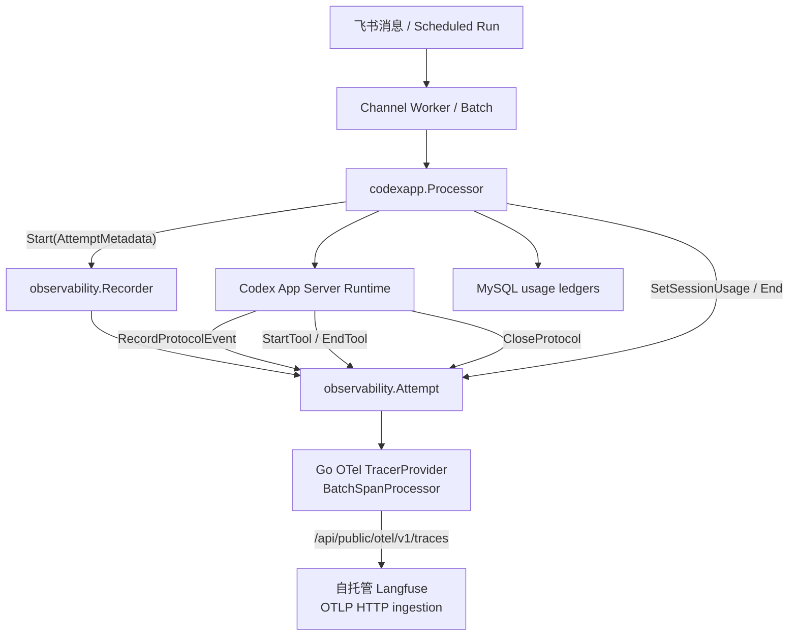
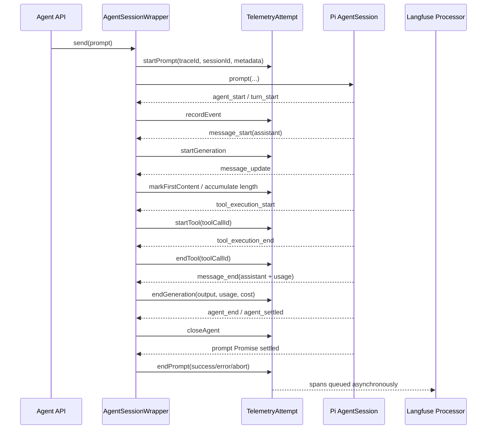

# 参考 codex_workspace_bot 的 Langfuse 接入对照与落地建议

> 状态：参考实现分析，尚未修改 Pi Web Desktop 代码  
> 参考仓库：`/Volumes/WorkSSD/githubwork/codex_workspace_bot`  
> 目标仓库：Pi Web Desktop  
> 编写日期：2026-08-07  
> 配套文档：[Langfuse 接入实施计划](./langfuse-integration-plan.zh-CN.md)

## 1. 文档目的

本文不是重复描述通用 Langfuse 接入步骤，而是基于 `codex_workspace_bot` 已存在的 Langfuse 实现，回答以下问题：

1. 参考项目已经解决了哪些可观测性问题？
2. 哪些设计可直接迁移到 Pi Web Desktop？
3. 哪些设计与 Pi Web Desktop 的产品边界冲突，不能直接照搬？
4. 参考代码中的 `Recorder → Attempt → protocol/tool spans → shutdown` 模式，如何改造成 TypeScript、Next.js 和 Pi `AgentSession` 版本？
5. 原 Langfuse 接入计划应根据参考实现补充或修订哪些内容？

本文以参考项目当前 checkout 的代码和文档为准。参考项目工作区存在未提交改动，因此本文只读取和分析，没有修改参考仓库。

## 2. 两个项目的核心差异

| 维度 | codex_workspace_bot | Pi Web Desktop |
| --- | --- | --- |
| 语言与运行时 | Go 1.23 长期服务 | Node.js 22+、Next.js 16、Electron |
| Agent 接入 | 一个长期运行的 `codex app-server --stdio` | 进程内 Pi `AgentSession` |
| 入口 | 飞书 WebSocket / 调度任务 | React HTTP 请求 / SSE |
| 调度单位 | 同频道 Worker 串行、不同频道并行 | 每个 session id 一个 `AgentSessionWrapper` |
| 会话事实来源 | MySQL + Codex Thread | Pi JSONL `SessionManager` |
| 实时协议 | App Server JSON-RPC notifications | Pi `AgentSessionEvent` |
| Trace 主键 | 业务预生成的 canonical 32hex trace id | 当前没有独立 prompt trace id |
| Session 标识 | `app_id:chat_type:chat_id` | Pi session id |
| 用量来源 | `turn/completed.usage` 或 Thread cumulative snapshot | assistant message `usage` / session stats |
| Langfuse 接入 | Go OTel SDK 直发 OTLP/HTTP | 计划使用 Langfuse JS/TS v5 + OTel |
| 数据策略 | 个人自托管项目，业务内容明文全量 | 建议默认最小采集和脱敏 |
| 生命周期终态 | Protocol terminal 与 delivery terminal 分离 | Agent terminal 与客户端 SSE/UI 收敛分离 |

最重要的结论是：

> 可以迁移参考项目的状态机、fail-open、canonical correlation、工具并发、usage 校验、批量导出和 shutdown 思路，但不能照搬其“全部业务内容明文上传”策略，也不能照搬 Codex Thread/Turn/Item 的事件模型。

## 3. 参考项目的实际接入架构

参考项目没有使用 Go 版 Langfuse SDK，而是使用 OpenTelemetry SDK 直接向 Langfuse OTLP HTTP endpoint 导出。



关键实现文件：

| 文件 | 作用 |
| --- | --- |
| `internal/observability/recorder.go` | OTel provider、Langfuse 属性映射、trace/tool/item 状态机 |
| `internal/observability/usage.go` | token bucket 校验、snapshot delta 和 loop usage |
| `internal/observability/sanitize.go` | 当前业务数据 identity transform |
| `internal/observability/recorder_test.go` | canonical trace id、endpoint、tool、usage 测试 |
| `internal/config/config.go` | 可观测性配置、默认值、凭据解析 |
| `cmd/server/main.go` | 初始化、degraded 状态、shutdown flush |
| `internal/codexapp/processor.go` | 创建 root attempt、结束 trace、写会话 usage |
| `internal/codexapp/runtime.go` | 投影协议事件、tool lifecycle 和 protocol terminal |
| `migrations/008_s08_langfuse_usage_ledger.sql` | Turn 和 Session usage ledger |
| `migrations/009_s08_thread_usage_snapshots.sql` | Thread cumulative usage 高水位 |

## 4. 参考实现中值得直接借鉴的设计

### 4.1 独立 Recorder/Attempt 抽象

参考项目没有把 OTel 调用散落在 Worker、Runtime 和 Storage 中，而是集中为：

```text
Recorder
└── Start(metadata) → Attempt
    ├── RecordProtocolEvent(...)
    ├── StartTool(...)
    ├── EndTool(...)
    ├── CloseProtocol(...)
    ├── SetSessionUsage(...)
    └── End(...)
```

对应 Pi Web Desktop，建议坚持原计划中的两层 adapter：

```text
LangfuseRecorder
└── AgentTelemetryRun
    ├── handleAgentEvent(...)
    ├── startTool(...)
    ├── endTool(...)
    ├── closeAgent(...)
    └── endPrompt(...)
```

推荐 TypeScript 结构：

```typescript
export interface TelemetryRecorder {
  startPrompt(metadata: PromptMetadata): TelemetryAttempt;
  forceFlush(timeoutMs?: number): Promise<void>;
  shutdown(timeoutMs?: number): Promise<void>;
}

export interface TelemetryAttempt {
  recordAgentEvent(event: AgentSessionEvent): void;
  startTool(toolCallId: string, toolName: string, args: unknown): boolean;
  endTool(toolCallId: string, result: unknown, error?: unknown): void;
  closeAgent(result: AgentTerminalResult): void;
  endPrompt(result: PromptTerminalResult): void;
  abandon(reason: string): void;
}
```

这样 `rpc-manager.ts` 只依赖项目接口，不依赖 Langfuse 具体 API。

### 4.2 Fail-open 和 degraded 状态

参考项目行为：

```text
enabled=false                         → disabled
配置开启但未完成 Project binding      → awaiting_project_binding
构造 exporter 失败                    → degraded
构造成功                              → ready
```

并且 exporter 异常不会使飞书 ingress 失败。

Pi Web Desktop 可以迁移为：

```text
disabled
awaiting_credentials
ready
degraded
shutting_down
```

建议在本地服务端日志输出一次状态，但第一阶段不必新增 UI 状态接口。如果后续需要 UI，可在已有设置面板增加只读状态，不能返回 key。

### 4.3 有界 BatchSpanProcessor

参考项目通过有界 queue 和 export timeout 实现异步批量导出。

可迁移原则：

- Agent 热路径只创建和结束 observation；
- 不等待 Langfuse HTTP；
- 队列有界；
- exporter timeout 有界；
- 退出时有限时间 flush；
- 队列满允许丢 telemetry，不允许阻塞 prompt。

使用 Langfuse JS v5 时由 `LangfuseSpanProcessor` 和 OTel SDK 承担批处理。实现后必须确认其默认 export mode 和队列行为；如 SDK 暴露相关参数，按项目需求设置而不是依赖不明确默认值。

### 4.4 显式 Attempt 状态，不依赖隐式上下文

参考 `Attempt` 显式保存 active loop、tools map、items map、terminal 状态和 late event count。

这与 Pi Web Desktop 非常契合。Pi SDK 事件来自长期 `subscribe()` 回调，因此应显式保存当前 run，而不能只依赖 `startActiveObservation()` 的 AsyncLocalStorage context。

建议 Pi 状态：

```typescript
type ActivePromptAttempt = {
  runId: string;
  root: ObservationHandle;
  activeGeneration: ObservationHandle | null;
  tools: Map<string, ObservationHandle>;
  agentClosed: boolean;
  promptClosed: boolean;
  lateEventCount: number;
  retryAttempt: number;
};
```

### 4.5 Tool 以 call id 成对管理

参考项目以 `callID` 配对 `StartTool` 与 `EndTool`，正确支持并行工具和重复结束保护。

Pi 事件天然提供 `toolCallId`，应直接采用同一模式：

```text
tool_execution_start(toolCallId)
    → tools.set(toolCallId, observation)

tool_execution_end(toolCallId)
    → tools.get + update + end + delete
```

在 Agent terminal 时，对尚未结束的工具统一标记：

```text
tool_result_available=false
reason=agent_terminal_before_tool_result
```

### 4.6 终态 fence 和 late event 计数

参考项目在 protocol closed 后不再创建 child span，而是增加 late event count。Runtime 对工具还使用 attempt mutex 建立 terminal fence，防止终态后启动有副作用的 handler。

Pi Web Desktop 的工具执行由 Pi SDK 自己管理，不需要复制 handler permit 机制，但 telemetry 侧仍应实现：

- Agent terminal 后不再创建 generation/tool observation；
- late event 只计数；
- 重复 `message_end` 或 `tool_execution_end` 幂等；
- wrapper shutdown 时关闭未完成 observation；
- 不让 late SSE 事件影响服务端 trace，因为 Langfuse 插桩位于 SDK 事件源而不是浏览器。

### 4.7 高频增量合并

参考项目不会为数百个 `agentMessage/delta` 分别建立 observation，而是按 item id 累积文本，完成时更新一次 output。

Pi Web Desktop 同样不应为每个 `message_update` 建 span/event。建议：

- `message_start`：创建 generation；
- `message_update`：只记录首内容时间和可选累计长度，不发送每个 chunk；
- `message_end`：一次性写 output、usage、cost、stop reason并结束 generation。

### 4.8 Usage bucket 必须验证包含关系

参考项目确认 input/output计数包含 cache/reasoning子计数，因此先转换为互斥 bucket再写Langfuse。

Pi 当前 usage 类型是：

```typescript
{
  input,
  output,
  cacheRead,
  cacheWrite,
  cost
}
```

必须先确认 Pi SDK 对这些字段的语义，再决定 Langfuse 映射：

- 不应自动假设 `input` 已排除 `cacheRead`；
- 不应把 cache token 同时写入总 input 和独立 cache bucket导致双算；
- 应使用测试 fixture验证 session stats与Langfuse usage一致；
- 若无法证明包含关系，保留 raw metadata，并标记 `usageDetailsAvailable=false`，不要猜测。

这是原计划需要加强的地方。

### 4.9 Canonical trace id作为跨系统关联键

参考项目使 MySQL message trace id、OTel trace id和Langfuse trace id完全一致。

Pi Web Desktop 当前没有 prompt-level canonical id。建议新增一个随机32位小写hex run id：

```typescript
const traceId = randomBytes(16).toString("hex");
```

好处：

- 本地日志可只记录 trace id，不记录正文；
- 出错时可由日志一跳定位Langfuse；
- 未来如需本地诊断表，不必再做id映射。

但不建议第一阶段修改Pi JSONL schema写入trace id。可以先放在wrapper内存、结构化服务端日志和Langfuse中。

### 4.10 统一 shutdown顺序

参考项目在server main集中管理telemetry shutdown。

Pi Web Desktop应从参考方案得到的直接结论：

> 不应继续让 `rpc-manager.ts`、Langfuse instrumentation和Electron各自注册独立的signal退出逻辑。

推荐统一顺序：

```text
收到 SIGINT/SIGTERM 或 Electron Quit
    ↓
标记 server shutting down
    ↓
停止创建新 AgentSession / telemetry attempt
    ↓
shutdown 所有 AgentSession 和 extensions
    ↓
forceFlush + shutdown telemetry（有界超时）
    ↓
退出 Next.js child
    ↓
Electron 超时后才强制 kill
```

## 5. 不能直接照搬的部分

### 5.1 不能照搬明文全量业务数据策略

参考项目的项目级指令明确要求prompt、reasoning、工具参数/结果、附件和路径全部明文，且 `SanitizeBusinessValue()` 是identity transform。

这是参考项目操作者针对个人自托管Langfuse做出的特定产品裁决，不是通用最佳实践。

Pi Web Desktop具有不同边界：

- 是可发布的npm/Electron产品；
- 会浏览任意开发项目；
- 工具可能读取源代码和 `.env`；
- 用户可能使用Cloud Langfuse；
- 可能存在多个最终用户。

因此Pi Web Desktop应保留默认最小采集：

```text
none | metadata | full-explicit-opt-in
```

并采用工具专用redactor、processor mask和payload size limit。

### 5.2 不能照搬 Thread/Turn/Item树

Codex参考项目的树是Thread → Turn → reasoning Item → agentMessage/tool Item。

Pi SDK的真实事件模型是：

```text
prompt
  → agent_start
  → turn_start
  → message_start/update/end
  → tool_execution_start/end
  → turn_end
  → agent_end
  → agent_settled / prompt_done
```

Pi应按自己的真实事件建树，不要制造Codex Item ID。

### 5.3 不需要 MySQL usage ledger

参考项目需要ledger，是因为Codex Thread usage是累计高水位且权威Turn usage可能缺失。

Pi Web Desktop已有JSONL和assistant message usage，通常可以从历史重算session stats。因此第一阶段不需要引入数据库或ledger。

可借鉴的原则是：

- 使用权威完整消息usage；
- 不猜测缺失usage；
- 不重复计算cache token；
- 对重复event保持幂等。

### 5.4 不需要 Project binding nonce作为硬前置

参考项目通过人工nonce read-back防止向错误的自托管Project明文写入全部业务数据。

Pi可以借鉴“先做test trace read-back”的发布关卡，但不一定把nonce作为运行配置字段。更简单的方案是默认disabled，提供固定合成payload的连接测试，成功后由操作者显式开启。

### 5.5 Go OTLP属性名不应直接复制到JS v5 API

参考项目手工写 `langfuse.trace.*` 和 `langfuse.observation.*` 属性，是因为Go没有原生Langfuse SDK。

Pi使用Langfuse JS/TS v5，应优先调用高层API：

```typescript
startObservation(..., { asType: "generation" })
propagateAttributes({ sessionId, version, environment, tags })
observation.update({ input, output, model, usageDetails })
```

仅在v5 SDK无法表达需要字段时，才落到OTel attributes。

## 6. 根据参考实现修订后的Pi Web Desktop方案

### 6.1 推荐模块结构

```text
instrumentation.ts
lib/observability/
├── config.ts
├── instrumentation-node.ts
├── recorder.ts
├── attempt.ts
├── pi-event-projector.ts
├── redaction.ts
├── usage.ts
└── types.ts
```

| 模块 | 责任 |
| --- | --- |
| `config.ts` | 配置解析与默认值 |
| `instrumentation-node.ts` | NodeSDK、LangfuseSpanProcessor、sampler和单例 |
| `recorder.ts` | Langfuse SDK adapter、no-op、flush/shutdown |
| `attempt.ts` | 一个prompt的显式状态机 |
| `pi-event-projector.ts` | `AgentSessionEvent` 到observation的纯映射 |
| `redaction.ts` | 内容与工具专用脱敏 |
| `usage.ts` | usage/cost语义校验与映射 |
| `types.ts` | 项目内部接口，不暴露Langfuse类型给业务层 |

### 6.2 推荐生命周期



### 6.3 Root与Agent两层终态

Pi Web Desktop有两个服务端终态维度：

1. Agent terminal：Pi SDK完成模型、工具、retry和compaction。
2. Prompt request terminal：`inner.prompt()` Promise完成或失败。

客户端SSE/UI是否收到结束事件不应决定服务端trace终态。

建议字段：

```text
agent_status = completed | failed | aborted
prompt_status = resolved | rejected | abandoned
```

### 6.4 Canonical trace id

新增服务端helper生成32位小写hex id。要求每个普通prompt一个，trace id写入安全结构化日志，不默认写入客户端或SSE。

如果Langfuse JS v5允许指定trace id，应优先使用官方API；若无法指定，则将自生成run id作为metadata correlation，不为追求id相等而侵入OTel IDGenerator。

### 6.5 Usage映射关卡

新增独立 `usage.ts`，所有计数先验证有限、非负和包含关系。Langfuse SDK不支持的bucket保留为raw metadata；cost total与分项不一致时保留raw值并标记原因。同一assistant message只记录一次。

### 6.6 Payload大小策略

即使显式开启full模式，也必须有硬上限：

| 内容 | 建议默认上限 |
| --- | --- |
| root input/output摘要 | 16 KiB |
| full prompt/output | 128 KiB |
| tool input/output摘要 | 16 KiB |
| metadata JSON | 32 KiB |
| error message | 4 KiB |
| stack | 默认不上传；调试模式最多16 KiB |

超限后记录截断状态、原始字节数、捕获字节数和hash，不默认分片上传完整代码或二进制。

### 6.7 配置状态

建议状态：

```typescript
type TelemetryStatus =
  | { state: "disabled" }
  | { state: "awaiting_credentials"; reason: string }
  | { state: "ready" }
  | { state: "degraded"; reason: string }
  | { state: "shutting_down" };
```

状态和日志不得包含secret。

## 7. 具体文件级实施建议

### 7.1 `instrumentation.ts`

- 仅在Node runtime动态导入instrumentation。
- 负责启动一次，不负责业务trace。

### 7.2 `lib/observability/instrumentation-node.ts`

- 解析配置；
- 初始化processor；
- 设置状态；
- 初始化失败降级no-op；
- 使用 `globalThis` 防止hot reload重复注册。

### 7.3 `lib/observability/recorder.ts`

- `startPrompt()` 返回attempt；
- 统一Langfuse SDK调用；
- no-op attempt；
- `forceFlush()` / `shutdown()`；
- 不做Pi事件判断。

### 7.4 `lib/observability/attempt.ts`

- 保存root、active generation和tools map；
- 提供幂等close；
- terminal fence；
- late event count；
- abandon未完成children。

### 7.5 `lib/observability/pi-event-projector.ts`

建议使用纯函数：

```typescript
projectAgentEvent(state, event, policy) → actions[]
```

测试无需真实Langfuse。

### 7.6 `lib/rpc-manager.ts`

只增加最小调用：

```typescript
this.telemetry.handleEvent(event);
this.emit(event);
```

以及prompt开始和Promise settle时的attempt调用。避免在现有switch中塞入大段Langfuse字段映射。

### 7.7 `lib/server-shutdown.ts`

统一RPC registry shutdown、telemetry shutdown、signal exit code、超时和幂等。

### 7.8 `electron/main.js`

tray Quit和before-quit先请求child优雅终止，等待有限时间后才强制kill。BrowserWindow close仍保持隐藏到托盘。

## 8. 测试借鉴清单

| 参考测试思想 | Pi对应测试 |
| --- | --- |
| canonical trace id | run id格式、唯一性和Langfuse correlation |
| root input/output | capture policy下的摘要和脱敏 |
| endpoint与认证 | mock exporter验证配置不泄漏key |
| snapshot delta | Pi usage映射语义与去重 |
| tool input/result | tool redactor + start/end配对 |
| invalid trace id | adapter对非法显式id降级或拒绝 |
| duplicate snapshot | duplicate message/tool event幂等 |
| terminal before tool result | 未完成tool在agent terminal时收尾 |
| shutdown flush | 有界flush、超时不阻塞退出 |
| exporter错误 | Agent prompt仍成功 |

建议新增：

```text
lib/observability/config.test.mjs
lib/observability/redaction.test.mjs
lib/observability/usage.test.mjs
lib/observability/pi-event-projector.test.mjs
lib/observability/attempt.test.mjs
lib/observability/recorder.test.mjs
lib/server-shutdown.test.mjs
```

## 9. 对原接入计划的修订结论

应保留：

- 服务端-only；
- 一个prompt一个trace；
- Pi session id作为Langfuse sessionId；
- AgentSessionWrapper作为插桩边界；
- fail-open；
- 默认最小采集；
- shutdown flush；
- 分阶段实施。

应加强：

1. 明确 `Recorder → Attempt` 项目接口。
2. 显式attempt状态机、terminal fence和late event处理。
3. 以 `toolCallId` Map支持并行工具。
4. `message_update`仅做内存聚合，不逐chunk导出。
5. usage/cost建立独立纯模块和语义验证。
6. 增加canonical prompt run id。
7. 明确Agent terminal与prompt Promise terminal两个维度。
8. 统一RPC session与telemetry shutdown。
9. 增加payload硬上限。
10. 增加telemetry自身状态。

不应迁移：

1. 业务数据identity sanitizer。
2. 明文上传完整代码、附件base64、命令输出和路径。
3. Codex Thread/Turn/Item命名和树结构。
4. MySQL usage ledger。
5. Go OTLP底层属性作为首选JS实现。
6. 自托管项目专属的强制Project binding字段，除非产品决定上传正文。

## 10. 修订后的实施优先级

```text
P0：确认部署与数据策略
    ↓
P1：config + instrumentation + recorder/no-op
    ↓
P2：Attempt状态机 + root prompt trace
    ↓
P3：assistant generation + tool Map + 增量聚合
    ↓
P4：usage/cost语义验证 + retry/compaction
    ↓
P5：统一shutdown + Electron优雅退出
    ↓
P6：dashboard、连接测试和运行手册
```

每个阶段必须先以fake recorder测试状态机，再连接真实Langfuse测试Project。不能以“Langfuse UI出现一条trace”替代父子关系、用量、隐私、fail-open和退出flush的完整验证。

## 11. 参考项目证据索引

以下路径位于 `/Volumes/WorkSSD/githubwork/codex_workspace_bot`：

| 主题 | 路径 |
| --- | --- |
| Langfuse Story设计 | `docs/story/S08-Langfuse全链路Trace可观测性-设计.md` |
| Langfuse查询工具规划 | `docs/story/S09-跨应用对话历史与Langfuse查询工具-设计.md` |
| Recorder实现 | `internal/observability/recorder.go` |
| Usage语义 | `internal/observability/usage.go` |
| 数据策略 | `internal/observability/sanitize.go` |
| Recorder测试 | `internal/observability/recorder_test.go` |
| Usage测试 | `internal/observability/usage_test.go` |
| 配置 | `internal/config/config.go` |
| 服务初始化与shutdown | `cmd/server/main.go` |
| Trace创建 | `internal/codexapp/processor.go` |
| 协议与工具事件投影 | `internal/codexapp/runtime.go` |
| Turn/session usage ledger | `migrations/008_s08_langfuse_usage_ledger.sql` |
| Thread usage snapshot | `migrations/009_s08_thread_usage_snapshots.sql` |
| 配置模板 | `config.yaml.template`、`.env.example` |

## 12. 最终建议

参考项目最值得迁移的不是某一段OTel代码，而是以下工程原则：

> 可观测性拥有独立状态机；业务只发送真实可证明的数据；高频增量先合并；并行工具按call id管理；用量先验证再映射；终态必须幂等；导出永远fail-open；进程退出必须有界flush。

Pi Web Desktop应在这些原则上使用Langfuse JS/TS v5的高层API，并保留更严格的默认隐私策略。这样既能利用参考项目已经验证过的工程经验，又不会把一个个人自托管飞书Bot的数据策略错误复制到可发布的桌面开发工具中。
