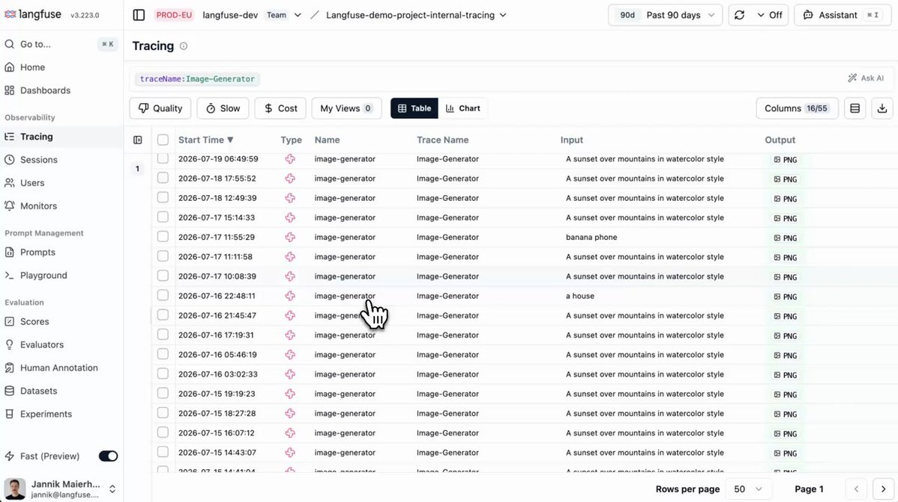

# Manage Langfuse dashboards via API, CLI, and MCP

- 作者：langfuse.com (@langfuse)
- X 原文：https://x.com/langfuse/status/2079863575007420562
- 发布时间：Wed Jul 22 09:38:12 +0000 2026
- 归档日期：2026-08-07
- 关联官方文档：https://langfuse.com/changelog/2026-07-17-dashboard-and-widget-operations-in-api

> 说明：以下内容来自 X 原帖/长文及其明确链接的 Langfuse 官方文档。归档保留原文，不将中文摘要冒充原文。

## X 原帖

manage dashboards via API, CLI, MCP & Langfuse Assistant

create and manage dashboards and widgets via the public API, let agents build them through the MCP server or CLI, or ask the Langfuse Assistant in the UI.

https://langfuse.com/changelog/2026-07-17-dashboard-and-widget-operations-in-api

## 关联官方文档快照

# Manage dashboards via API, CLI, and MCP

Lysander Kiesel

[Video 2](https://static.langfuse.com/docs-videos/dashboard-widget-api.mp4)

Create and manage dashboards and widgets programmatically through the public API and Langfuse CLI, let AI agents build them via the Langfuse MCP server, or ask the Langfuse Assistant in the UI.

You can now create and manage dashboards end-to-end in code and through your agent. New endpoints under `/api/public/unstable` cover dashboards, the placements on their grid, and the reusable widgets those placements reference. The [Langfuse CLI](http://langfuse.com/docs/api-and-data-platform/features/cli) picks the endpoints up automatically, and the [Langfuse MCP server](http://langfuse.com/docs/api-and-data-platform/features/mcp-server) exposes the same operations as tools.

This opens up a few workflows beyond the dashboard editor in the UI:

*   **Dashboards as code**: keep dashboard definitions in version control and apply the same monitoring setup across projects and environments.
*   **Agent-built dashboards**: ask an AI agent for a dashboard, e.g. error traces for a certain feature over time. Reads run automatically, and every change goes through human-in-the-loop approval.
*   **Incremental edits**: add, move, or resize a single tile through the placement endpoints without resubmitting the whole layout. Omit the position and the server appends the tile for you.

The same tools power the [Langfuse Assistant](http://langfuse.com/docs/langfuse-assistant) in the UI, so you can ask it to create or update dashboards and widgets directly. The Assistant is available when AI features are enabled for your organization (org admins can enable them in the organization settings).

## [New endpoints](http://langfuse.com/changelog/2026-07-17-dashboard-and-widget-operations-in-api#new-endpoints)

*   `/dashboards` — list, create, read, update, and delete dashboards, including their filters and full layout definition. See the [dashboards API reference](https://api.reference.langfuse.com/#tag/unstabledashboards).
*   `/dashboards/{dashboardId}/placements` — add, move or resize, and remove individual tiles on a dashboard's grid, documented alongside the [dashboards API reference](https://api.reference.langfuse.com/#tag/unstabledashboards).
*   `/dashboard-widgets` — list, create, read, update, and delete the reusable widgets that placements reference. See the [dashboard widgets API reference](https://api.reference.langfuse.com/#tag/unstabledashboardwidgets).

## [New MCP tools](http://langfuse.com/changelog/2026-07-17-dashboard-and-widget-operations-in-api#new-mcp-tools)

**Dashboards**

`listDashboards``getDashboard``createDashboard``updateDashboard``deleteDashboard`
**Placements**

`addDashboardPlacement``updateDashboardPlacement``deleteDashboardPlacement`
**Widgets**

`listDashboardWidgets``getDashboardWidget``createDashboardWidget``updateDashboardWidget``deleteDashboardWidget`

These endpoints and MCP tools are **unstable** and may change while the dashboard and widget contract is being finalized. The dashboard editor in the UI remains fully supported.

## [Get started](http://langfuse.com/changelog/2026-07-17-dashboard-and-widget-operations-in-api#get-started)

### [Custom dashboards](http://langfuse.com/docs/metrics/features/custom-dashboards)### [API reference](https://api.reference.langfuse.com/#tag/unstabledashboards)### [MCP server documentation](http://langfuse.com/docs/api-and-data-platform/features/mcp-server)
