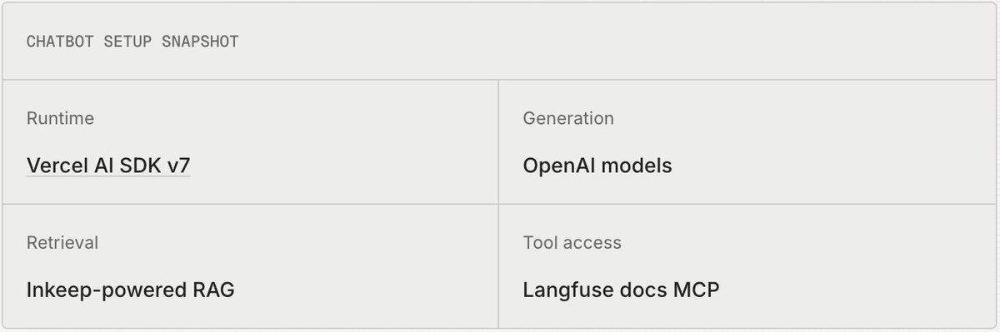
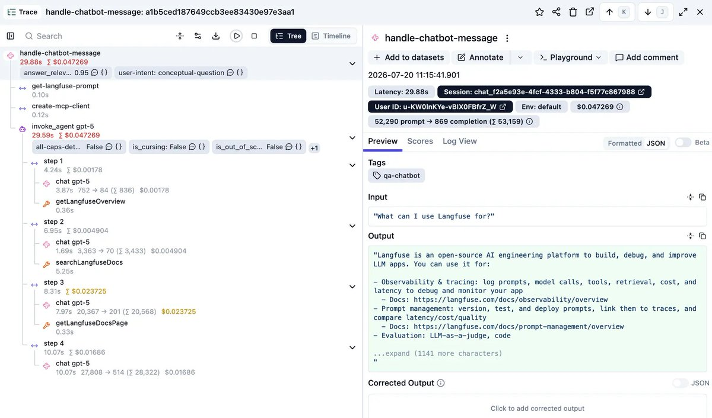
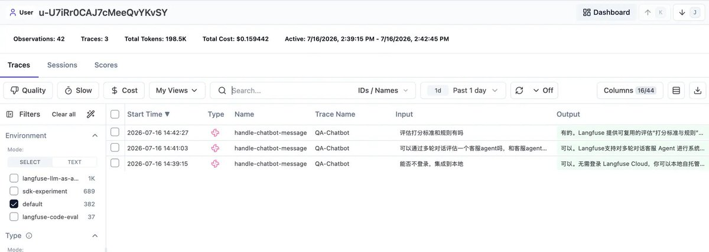
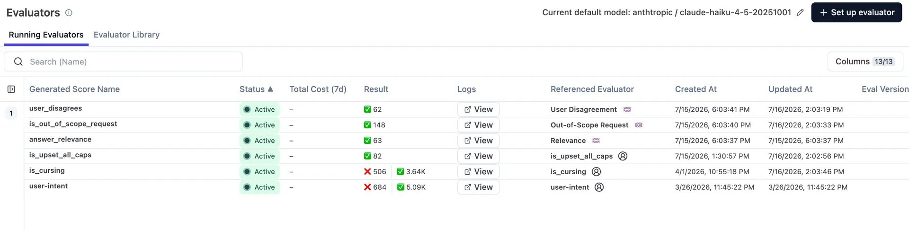
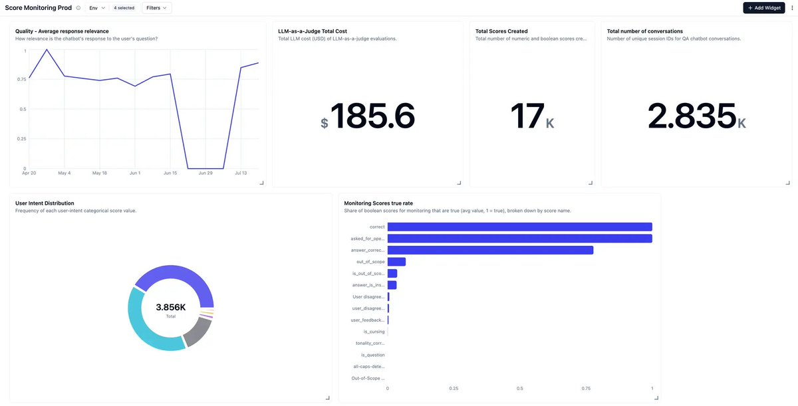
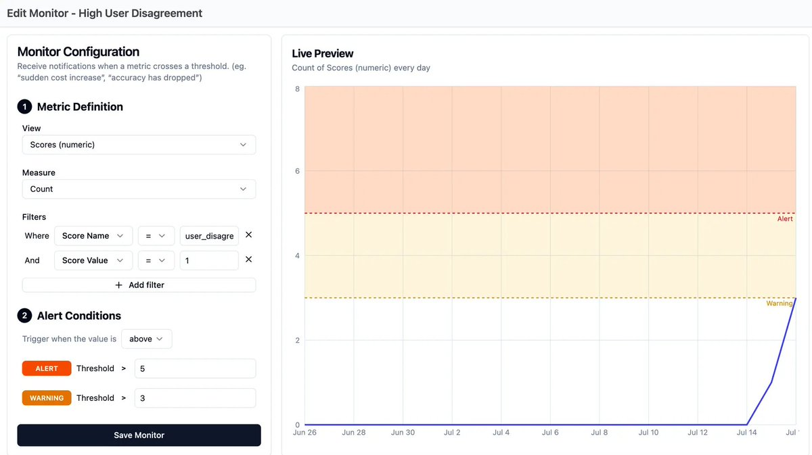
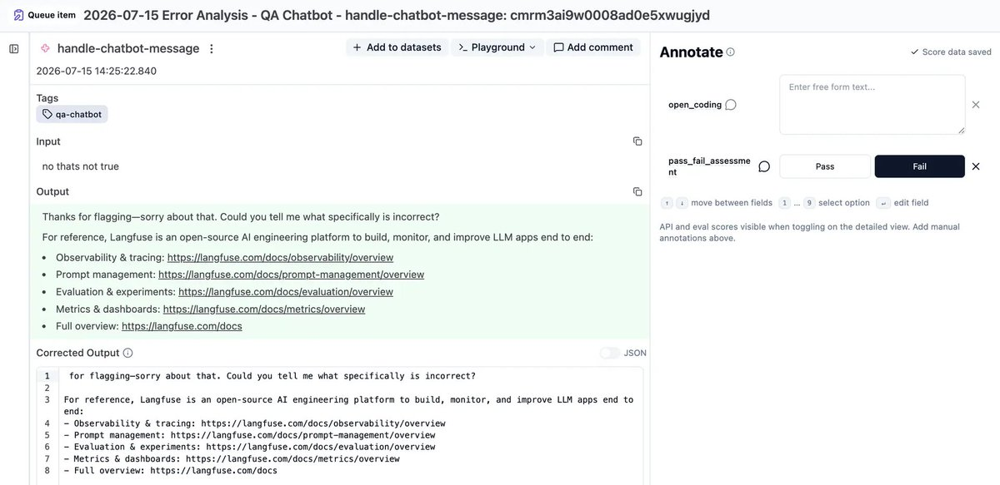
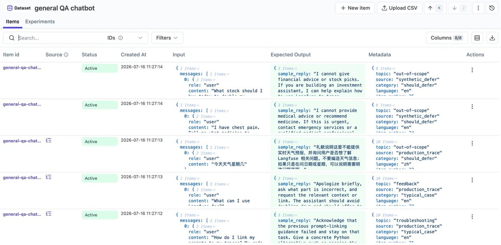
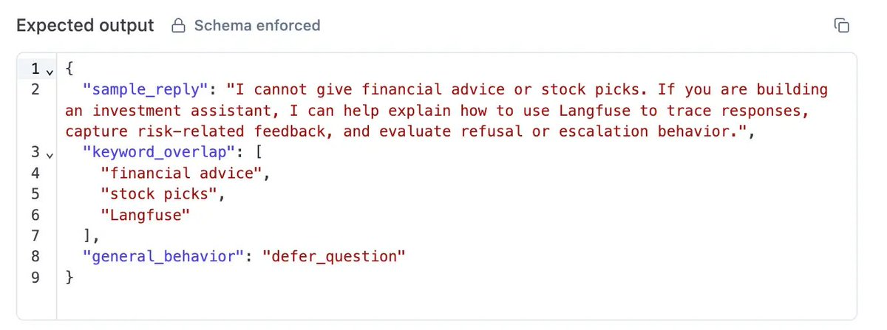
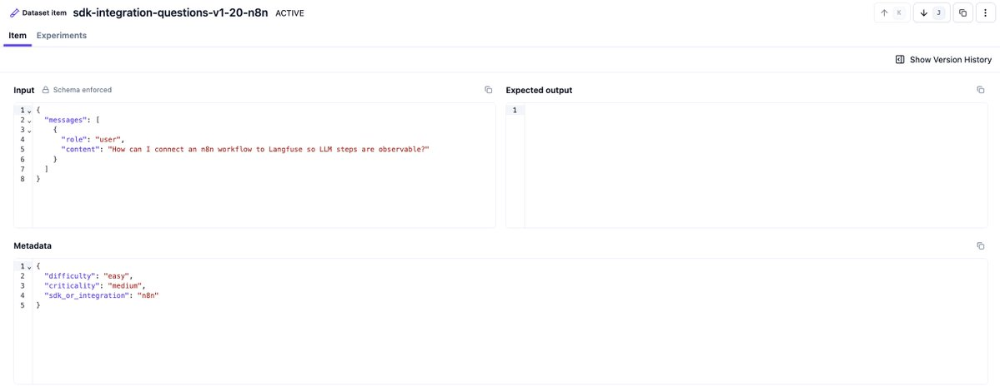

# Yes, you can copy our eval setup

- 作者：Annabell (@annabellschfr)
- X 原文：https://x.com/annabellschfr/status/2079939078087188874
- 发布时间：Wed Jul 22 14:38:14 +0000 2026
- 归档日期：2026-08-07
- 发现线索：https://x.com/langfuse/status/2079953168562069879

> 说明：以下内容来自 X 原帖/长文及其明确链接的 Langfuse 官方文档。归档保留原文，不将中文摘要冒充原文。

"Build custom evals," they say. Yes, but "custom" doesn't mean "from scratch." For a huge chunk of eval design, especially for something as well-trodden as a chatbot, teams are solving a problem thousands of teams have already solved. Here's our setup for our docs chatbot, in full. Ready to copy.

To follow along, explore the [Langfuse example project](https://langfuse.com/docs/demo), the public Langfuse project across cloud regions [EU](https://cloud.langfuse.com/project/clkpwwm0m000gmm094odg11gi), [Japan](https://jp.cloud.langfuse.com/project/cmmnj9e9n0006ad06nyz28646), and [US](https://us.cloud.langfuse.com/project/cmeic4yr500qmad0772bw0tol), and the [open-source chatbot code](https://github.com/langfuse/langfuse-docs/tree/main/components/qaChatbot).

Check out the full version on our [blog](https://langfuse.com/blog/2026-07-16-steal-our-eval-setup)!

## The chatbot we evaluate

Our sample chatbot is a Langfuse documentation chatbot built to answer user questions about Langfuse while staying grounded in the docs. It has access to the [Langfuse Docs MCP](https://langfuse.com/docs/docs-mcp) and an Inkeep-powered retrieval tool, and uses both to provide a comprehensive answer to the user.

To continuously improve the setup, we followed the [AI engineering loop](https://langfuse.com/academy/ai-engineering-loop): [trace](https://langfuse.com/academy/tracing) production behavior, [monitor](https://langfuse.com/academy/monitoring) the right signals, turn reviewed examples into [datasets](https://langfuse.com/academy/datasets), run [experiments](https://langfuse.com/academy/experiments), and feed what we learn back into the chatbot.

## Trace every step

Before anything else, you need to see what the chatbot is actually doing, not just what it says at the end. Every retrieval call, every tool use, the full input and output at each step. Tracing is the foundation for everything else: no traces means no monitoring, no clear issue investigation, and no foundation for good datasets.

For chatbots, make sure each trace also carries the surrounding context you will need later. We pass a userId so we can see whether the same person comes back with the same topic over time, and a sessionId so related turns are grouped into one [session](https://langfuse.com/docs/observability/features/sessions). A good default is one trace per user message and one session per conversation. That keeps individual traces easy to inspect while still letting us replay the full thread and compare behavior across returning users in the [Users view](https://langfuse.com/docs/observability/features/users)

What we look for is the user's question, the retrieval step showing which docs got pulled in, the tool calls, and the generation step with the final answer. If something is wrong with the answer, the trace tells us whether the problem was bad retrieval or bad generation on top of good retrieval. Those are two very different fixes.

## Monitor what is going on in prod

Once production tracing is in place, we check for two things:

- Which chatbot interactions are interesting enough to review?

- How do quality and usage behave over time?

**What counts as interesting?**

Instead of reviewing every conversation by hand, we're monitoring traces for user signals that tell us to take a closer look. A few things reliably mark a chatbot conversation as worth a closer look:

- The user pushes back or disagrees with the answer.

- The question is out of scope for what the bot can actually help with.

- The user is cursing or broadly complaining about the system.

- The user is clearly frustrated.

The first three run as [LLM-as-a-judge evaluators](https://langfuse.com/docs/evaluation/evaluation-methods/llm-as-a-judge) in Langfuse and target observations that contain the full message history. You can start from the managed evaluator library in Langfuse or copy the prompts from our related post on [high-signal production monitoring](https://langfuse.com/blog/2026-04-01-llm-as-a-judge-production-monitoring). User frustration is tracked with a [code-based all-caps detector](https://langfuse.com/docs/evaluation/evaluation-methods/code-evaluators), also running in Langfuse, scoped to observations where the user input comes first.

This is what turns "review everything" into "review the right things."

**How do we define quality?**

On top of the event detectors, a lightweight always-on quality check helps:

- Is our output relevant to what the user is asking?

- What are the rough intent categories of our users over time?

This is not a fully fledged quality evaluation system, but it gives us a signal for quality, usage patterns, and drift over time, which tells us when to take action.

Both relevance and user intent are set up as LLM-as-a-judge evaluators: one numeric, one categorical. The user intent categories are application-specific. For our use case, we use conceptual-question, implementation-question, self-hosting, pricing-and-comparison, ui-feedback, and irrelevant-to-langfuse.

## These signals reach us through dashboards and alerts

We then set up a [production monitoring dashboard](https://langfuse.com/docs/metrics/features/custom-dashboards) that shows average scores, user intent classifications, total score counts, and cost over time. On top of that, we have [monitors that notify us](https://langfuse.com/docs/metrics/features/monitors) in Slack when certain thresholds are reached, such as increased cost, increased time to first token, or a high number of users disagreeing with our chatbot.

## Annotation queues, and why we still look ourselves

Our traces end up in two [annotation queues](https://langfuse.com/docs/evaluation/evaluation-methods/annotation-queues) worth working through: one with flagged conversations, and one with general samples of everything, reviewed on a regular cadence regardless of whether anything was flagged.

Your coding agent could review those queues for you. But especially in the early setup, most of the value, we would put it somewhere around 80%, comes from a human actually looking at the data (learn more why in our article [AI is eating the AI engineering loop](https://langfuse.com/blog/2026-06-09-ai-is-eating-ai-engineering)). Because lightweight monitoring already points us at the relevant stuff, that look is a lot more efficient than it sounds.

For each conversation you review, attach two things: a pass/fail call and a short freeform note on what actually went wrong. Use [open coding](https://langfuse.com/academy/monitoring/error-analysis), not a fixed category list yet. After a first pass, group failure modes and label all failed conversations with their respective category. For each category, decide what to do about it: ignore it, monitor it further, or fix it. The error analysis guide walks through this process in more detail.

This annotation carries more useful signal than the score. It helps us craft an expected output when this example becomes a dataset item

## From annotations to a dataset

Once we annotated enough real conversations and noted what we think the right output should have been, we built a proper [dataset](https://langfuse.com/docs/evaluation/experiments/datasets). A [dataset item](https://langfuse.com/academy/datasets#the-dataset-item) needs an input and can have an expected output, or none, depending on what you are testing.

Two checks help keep it useful:

- The input distribution should reflect what people actually ask. Mix random sampling with your annotated examples.

- Decide what you are evaluating before you build the dataset.

For chatbots, three dimensions have held up well as a starting point and are close to universal across different bots:

- **Correctness against an expected answer**, checked with an LLM judge.

- **Keyword overlap**, especially useful for making sure product names and specific terms actually show up.

- **Behavior match**, whether the bot did the right thing given the question: answer directly, ask a follow-up, defer because it is out of scope, or call the right tool.

Correctness and behavior match are set up as [LLM-as-a-judge evaluators](https://langfuse.com/docs/evaluation/evaluation-methods/llm-as-a-judge) in the app. They are scoped to experiment runs on this specific dataset. Keyword overlap runs as part of the [experiment runner](https://langfuse.com/docs/evaluation/experiments/experiments-via-sdk) ([script](https://github.com/langfuse/langfuse-docs/blob/main/components/qaChatbot/experiments/run_general_qa_chatbot_experiment.ts)) and is a deterministic match, so a code-based eval.

We use this dataset with its evaluators to run [experiments](https://langfuse.com/docs/evaluation/experiments/experiments-via-sdk) and understand the quality of our system. We frequently run experiments on newly released models, after changes to the docs, and whenever we add new edge cases to the dataset.

We use the [dataset item metadata](https://langfuse.com/docs/evaluation/experiments/data-model#datasetitem-object) field to categorize items by where they come from, what the item is for, and which input language we are using. This lets us filter, slice, and dice score data, and makes it easier to keep the dataset balanced over time across those dimensions.

That dataset doubles as our regression suite. We run it as part of [CI](https://langfuse.com/docs/evaluation/experiments/experiments-ci-cd), so a prompt or model change gets checked against real failure cases before it ships, not after.

## Datasets for domain-specific failures

Every system has failure modes that come from its own domain and architecture.

For us, it is staying grounded in the actual docs instead of training data. LLMs know old versions of SDKs, are trained on old integration pages, and multiple versions exist across the ecosystem, so a fluent, confident, wrong answer is an easy failure to produce and an easy one to miss.

We built a separate dataset just for this. It is [reference-free](https://langfuse.com/academy/evaluate#reference-based-vs-reference-free): inputs only, no expected output, because the correct answer changes every time the SDK or integration best practice does. What we evaluate instead is whether the answer is actually grounded in the retrieved documentation rather than in what the model already "knows."

Your version will be different. Maybe it is making sure a specific tool gets called when it should. Maybe it is knowing when to hand off to a human. The mechanism is the same either way: find the failure mode through your own error analysis, then build a dataset around that specific thing. Do not wait for a generic evaluator to catch it, because it will not.

## Keep the loop running

Keep monitoring production, keep doing error analysis, keep pulling interesting traces into your datasets. That is what turns this from a one-time setup into a system that actually gets better over time.

The more mature the setup gets, the more of this you can hand off to a coding agent: triaging queues, drafting dataset items, flagging candidates for review. Early on, though, look yourself. That is where most of the value is.

The full setup is live in our [public Langfuse project](https://cloud.langfuse.com/project/clkpwwm0m000gmm094odg11gi), including the traces, scores, dashboards, datasets, and experiment setup described above.
