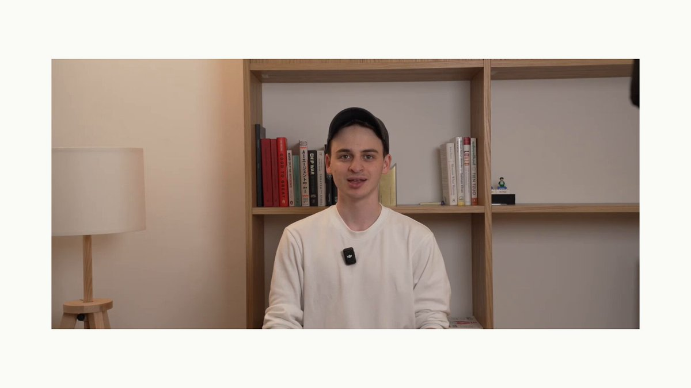

# OpenTelemetry-native tracing with Langfuse

- 作者：langfuse.com (@langfuse)
- X 原文：https://x.com/langfuse/status/2080280718836367816
- 发布时间：Thu Jul 23 13:15:47 +0000 2026
- 归档日期：2026-08-07
- 关联官方文档：https://langfuse.com/integrations/native/opentelemetry

> 说明：以下内容来自 X 原帖/长文及其明确链接的 Langfuse 官方文档。归档保留原文，不将中文摘要冒充原文。

## X 原帖

Langfuse speaks OpenTelemetry natively, so your LLM traces live right alongside the rest of your stack. Have a look at the video below to see how we use OTEL end to end 👇



## 关联官方文档快照

[OpenTelemetry (OTEL)](https://opentelemetry.io/) is a [CNCF](https://www.cncf.io/) project that provides a set of specifications, APIs, and libraries that define a standard way to collect distributed traces and metrics from your application.

Use this page if your application, framework, or collector already emits OpenTelemetry (OTEL) traces and you want to send them to Langfuse.

**Using Python or JavaScript/TypeScript?** Use the [Langfuse SDK](https://langfuse.com/docs/observability/sdk/overview) instead of building directly on the OTEL API. The SDK handles Langfuse attributes, propagation, media, filtering, and export for you. For other languages, use the [native OpenTelemetry API for your language](https://opentelemetry.io/docs/languages/) and export spans to Langfuse.

Langfuse can receive traces on the `/api/public/otel` (OTLP) endpoint.

If you use a Collector that uses the OpenTelemetry SDK to export traces, you can use the following configuration:

```
OTEL_EXPORTER_OTLP_ENDPOINT="https://cloud.langfuse.com/api/public/otel" # 🇪🇺 EU data region
# Other Langfuse data regions include 🇺🇸 US: https://us.cloud.langfuse.com/api/public/otel, 🇯🇵 Japan: https://jp.cloud.langfuse.com/api/public/otel and ⚕️ HIPAA: https://hipaa.cloud.langfuse.com/api/public/otel
# OTEL_EXPORTER_OTLP_ENDPOINT="http://localhost:3000/api/public/otel" # 🏠 Local deployment (>= v3.22.0)

OTEL_EXPORTER_OTLP_HEADERS="Authorization=Basic ${AUTH_STRING},x-langfuse-ingestion-version=4"
```

Langfuse uses [Basic Auth](https://en.wikipedia.org/wiki/Basic_access_authentication) to authenticate requests.

You can use the following command to get the base64 encoded API keys (referred to as `AUTH_STRING`): `echo -n "pk-lf-1234567890:sk-lf-1234567890" | base64`. For long API Keys on GNU systems, you may have to add `-w 0` at the end since `base64` auto-wraps columns.

### [Enable real-time ingestion in Langfuse v4](http://langfuse.com/integrations/native/opentelemetry#real-time-ingestion)

If you send spans directly via OpenTelemetry, include the `x-langfuse-ingestion-version: 4` header so that new data appears in real time on the v4 data model and the v2 Observations and Metrics APIs. Without this header, directly ingested OpenTelemetry data can be delayed by up to 10 minutes. The `OTEL_EXPORTER_OTLP_HEADERS` configuration above already includes the header.

If your setup uses signal-specific header settings, configure the same header on the traces exporter:

`OTEL_EXPORTER_OTLP_TRACES_HEADERS="Authorization=Basic ${AUTH_STRING},x-langfuse-ingestion-version=4"`

If your collector requires signal-specific environment variables, the trace endpoint is `/api/public/otel/v1/traces`.

```
OTEL_EXPORTER_OTLP_TRACES_ENDPOINT="https://cloud.langfuse.com/api/public/otel/v1/traces" # EU data region
# Other Langfuse data regions include 🇺🇸 US: https://us.cloud.langfuse.com/api/public/otel/v1/traces, 🇯🇵 Japan: https://jp.cloud.langfuse.com/api/public/otel/v1/traces and ⚕️ HIPAA: https://hipaa.cloud.langfuse.com/api/public/otel/v1/traces
```

Please note that Langfuse currently supports OTLP over HTTP with both `HTTP/JSON` and `HTTP/protobuf`. `gRPC` is not supported yet.

**Migrating to Langfuse v4?** If you send custom events to the legacy `/api/public/ingestion` endpoint, or already send OTEL spans that rely on trace input/output or root-only attributes, follow the [custom ingestion migration guide](https://langfuse.com/integrations/native/opentelemetry/migration-to-v4).

Langfuse can operate as an OpenTelemetry Backend to receive traces on the `/api/public/otel` (OTLP) endpoint. In addition to the [Langfuse SDKs](https://langfuse.com/docs/sdk/overview) and [native integrations](https://langfuse.com/integrations), this OpenTelemetry endpoint is designed to increase compatibility with frameworks, libraries, and languages beyond the SDKs and native integrations. Popular OpenTelemetry libraries include OpenLLMetry and OpenLIT which extend Language support of Langfuse tracing to Java and Go and cover frameworks such as AutoGen, Semantic Kernel, and more.

As the [Semantic Conventions](https://opentelemetry.io/docs/specs/semconv/attributes-registry/gen-ai/) for GenAI attributes on traces are still evolving, Langfuse maps the received OTel traces to the [Langfuse data model](https://langfuse.com/docs/observability/data-model) and supports additional attributes that are popular in the OTel GenAI ecosystem ([attribute mapping](http://langfuse.com/integrations/native/opentelemetry#property-mapping)). Please contribute to the discussion on [GitHub](https://github.com/orgs/langfuse/discussions/2509) if an integration does not work as expected or does not parse the correct attributes.

> **Using other OTEL-based tools?** If you're using Langfuse alongside other OpenTelemetry-based tools, you may run into conflicts. See [Using Langfuse with an Existing OpenTelemetry Setup](https://langfuse.com/faq/all/existing-otel-setup) for configuration guidance.

**Important:** If you want to filter and aggregate by `userId`, `sessionId`, `metadata`, `version`, `release`, or `tags`, you need to propagate these trace-level attributes to every span in the trace. Start with [Propagating Trace Attributes to All Spans](http://langfuse.com/integrations/native/opentelemetry#propagating-attributes) before wiring this up in production.

When using OpenTelemetry (OTEL) instrumentation to send traces to Langfuse, certain trace-level attributes should be propagated to **all spans** within a trace to enable accurate aggregations and filtering in Langfuse. These attributes include:

*   `userId` (via `langfuse.user.id` or `user.id`)
*   `sessionId` (via `langfuse.session.id` or `session.id`)
*   `metadata` (via `langfuse.trace.metadata.*` for top-level metadata keys)
*   `version` (via `langfuse.version`)
*   `release` (via `langfuse.release`)
*   `tags` (via `langfuse.trace.tags`)
*   `trace_name` (via `langfuse.trace.name`)

Langfuse filters and aggregations increasingly operate across individual observations rather than only at the trace level. If you want to reliably filter or aggregate by these attributes, they need to be present on each span in the trace, not only on the root span.

### [Recommended: Use OpenTelemetry Baggage for Propagation](http://langfuse.com/integrations/native/opentelemetry#recommended-use-opentelemetry-baggage-for-propagation)

The recommended approach for propagating these attributes across all spans is to use [OpenTelemetry Baggage](https://opentelemetry.io/docs/concepts/signals/baggage/) with a `BaggageSpanProcessor`. Baggage is a built-in OpenTelemetry mechanism for context propagation that automatically copies specified key-value pairs to all spans within a trace context.

To implement this pattern:

1.   Set the desired attributes as baggage entries at the beginning of your trace.
2.   Set the attributes on the currently active span.
3.   Configure a `BaggageSpanProcessor` in your OpenTelemetry setup to automatically copy baggage entries to span attributes.
4.   The processor will ensure all downstream spans in the trace context receive these attributes.

For implementation details and code examples, refer to the OpenTelemetry documentation for [Python](https://pypi.org/project/opentelemetry-processor-baggage/) and [JavaScript](https://www.npmjs.com/package/@opentelemetry/baggage-span-processor).

**Security Consideration:** OpenTelemetry baggage is propagated across service boundaries and to third-party APIs. **Do not include sensitive information** (passwords, API keys, personal data, etc.) in baggage when using this approach, as it will be transmitted to all downstream services.

### [Alternative: Use Langfuse SDK Helpers](http://langfuse.com/integrations/native/opentelemetry#alternative-use-langfuse-sdk-helpers)

If you're using the [Langfuse SDKs](https://langfuse.com/docs/observability/sdk/overview) with OpenTelemetry integration, you can use the convenience methods `propagate_attributes()` (Python) or `propagateAttributes()` (TypeScript), which handle attribute propagation automatically. These methods provide a simpler interface and are the recommended approach when using Langfuse SDKs.

### [OpenTelemetry native Langfuse SDK v4](http://langfuse.com/integrations/native/opentelemetry#opentelemetry-native-langfuse-sdk-v4)

The quickest path to start tracing with Langfuse is the new **OTEL-native Langfuse SDK v4**. The SDK is a thin layer on top of the official OpenTelemetry client that automatically converts emitted spans into rich Langfuse observations (spans, generations, events, and [other observation types](https://langfuse.com/docs/observability/features/observation-types)) and adds first-class helpers for LLM-specific features such as token usage, cost tracking, prompt linking, and scoring.

Because it lives in the shared OpenTelemetry context, spans from other OTEL-instrumented libraries can be exported to Langfuse too. By default, Langfuse focuses on LLM-relevant spans (Langfuse SDK spans, spans with `gen_ai.*` attributes, and known LLM instrumentors). To export everything, use a permissive custom filter as described in the [advanced SDK docs](https://langfuse.com/docs/observability/sdk/advanced-features#filtering-by-instrumentation-scope).

Get started by following the dedicated guide for the Python implementation here: [/docs/observability/sdk/overview](https://langfuse.com/docs/observability/sdk/overview).

### [Custom via OpenTelemetry SDKs](http://langfuse.com/integrations/native/opentelemetry#custom-via-opentelemetry-sdks)

You can use the OpenTelemetry SDKs to directly export traces to Langfuse with the configuration mentioned above. Thereby, Language support of Langfuse is extended to other languages than the ones supported by the [Langfuse SDKs](https://langfuse.com/docs/sdk/overview) (Python and JS/TS).

### [Run experiments via OpenTelemetry](http://langfuse.com/integrations/native/opentelemetry#experiments-ingesting-experiment-spans)

To group direct-OTEL traces as Langfuse experiments, add the experiment and item attributes described in [Ingest experiment spans with OpenTelemetry](https://langfuse.com/integrations/native/opentelemetry/experiments).

### [Use OpenTelemetry GenAI Instrumentation Libraries](http://langfuse.com/integrations/native/opentelemetry#use-opentelemetry-genai-instrumentation-libraries)

Any OpenTelemetry compatible instrumentation can be used to export traces to Langfuse. Check out the following end-to-end examples of popular instrumentation SDKs to get started:

**Libraries**

*   [OpenLIT](https://langfuse.com/docs/opentelemetry/example-openlit)
*   [OpenLLMetry](https://langfuse.com/docs/opentelemetry/example-openllmetry)
*   [Arize](https://langfuse.com/docs/opentelemetry/example-arize)
*   [MLflow](https://langfuse.com/docs/opentelemetry/example-mlflow)

Comparison of OpenTelemetry Instrumentation Libraries

| Category | Item | OpenLLMetry | openlit | Arize |
| --- | --- | --- | --- | --- |
| LLMs | AI21 |  | ✅ |  |
|  | Aleph Alpha | ✅ |  |  |
|  | Amazon Bedrock | ✅ | ✅ | ✅ |
|  | Anthropic | ✅ | ✅ | ✅ |
|  | Assembly AI |  | ✅ |  |
|  | Azure AI Inference |  | ✅ |  |
|  | Azure OpenAI | ✅ | ✅ |  |
|  | Cohere | ✅ | ✅ |  |
|  | DeepSeek |  | ✅ |  |
|  | ElevenLabs |  | ✅ |  |
|  | GitHub Models |  | ✅ |  |
|  | Google AI Studio |  | ✅ |  |
|  | Google Generative AI (Gemini) | ✅ |  |  |
|  | Groq | ✅ | ✅ | ✅ |
|  | HuggingFace | ✅ | ✅ | ✅ |
|  | IBM Watsonx AI | ✅ |  |  |
|  | Mistral AI | ✅ | ✅ | ✅ |
|  | NVIDIA NIM |  | ✅ |  |
|  | Ollama | ✅ | ✅ |  |
|  | OpenAI | ✅ | ✅ | ✅ |
|  | OLA Krutrim |  | ✅ |  |
|  | Prem AI |  | ✅ |  |
|  | Replicate | ✅ |  |  |
|  | SageMaker (AWS) | ✅ |  |  |
|  | Titan ML |  | ✅ |  |
|  | Together AI | ✅ | ✅ |  |
|  | vLLM |  | ✅ |  |
|  | Vertex AI | ✅ | ✅ | ✅ |
|  | xAI |  | ✅ |  |
| Vector DBs | AstraDB |  | ✅ |  |
|  | Chroma | ✅ |  |  |
|  | ChromaDB |  | ✅ |  |
|  | LanceDB | ✅ |  |  |
|  | Marqo | ✅ |  |  |
|  | Milvus | ✅ | ✅ |  |
|  | Pinecone | ✅ | ✅ |  |
|  | Qdrant | ✅ | ✅ |  |
|  | Weaviate | ✅ |  |  |
| Frameworks | AutoGen / AG2 |  | ✅ | ✅ |
|  | ControlFlow |  | ✅ |  |
|  | CrewAI | ✅ | ✅ | ✅ |
|  | Crawl4AI |  | ✅ |  |
|  | Dynamiq |  | ✅ |  |
|  | EmbedChain |  | ✅ |  |
|  | FireCrawl |  | ✅ |  |
|  | Guardrails AI |  | ✅ | ✅ |
|  | Haystack | ✅ | ✅ | ✅ |
|  | Julep AI |  | ✅ |  |
|  | LangChain | ✅ | ✅ | ✅ |
|  | LlamaIndex | ✅ | ✅ | ✅ |
|  | Letta |  | ✅ |  |
|  | LiteLLM | ✅ | ✅ | ✅ |
|  | mem0 |  | ✅ |  |
|  | MultiOn |  | ✅ |  |
|  | Phidata |  | ✅ |  |
|  | SwarmZero |  | ✅ |  |
|  | LlamaIndex Workflows |  |  | ✅ |
|  | LangGraph |  |  | ✅ |
|  | DSPy |  |  | ✅ |
|  | Prompt flow |  |  | ✅ |
|  | Instructor |  |  | ✅ |
| GPUs | AMD Radeon |  | ✅ |  |
|  | NVIDIA |  | ✅ |  |
| JavaScript | OpenAI Node SDK |  |  | ✅ |
|  | LangChain.js |  |  | ✅ |
|  | Vercel AI SDK |  |  | ✅ |

**Framework integrations powered by OpenTelemetry**

*   [Hugging Face smolagents](https://langfuse.com/integrations/frameworks/smolagents)
*   [CrewAI](https://langfuse.com/integrations/frameworks/crewai)
*   [AutoGen](https://langfuse.com/integrations/frameworks/autogen)
*   [Semantic Kernel](https://langfuse.com/integrations/frameworks/semantic-kernel)
*   [Pydantic AI](https://langfuse.com/integrations/frameworks/pydantic-ai)
*   [Spring AI](https://langfuse.com/integrations/frameworks/spring-ai)
*   [LlamaIndex](https://langfuse.com/integrations/frameworks/llamaindex)
*   [LlamaIndex Workflows](https://langfuse.com/integrations/frameworks/llamaindex-workflows)

### [Export from OpenTelemetry Collector](http://langfuse.com/integrations/native/opentelemetry#export-from-opentelemetry-collector)

If you run an [OpenTelemetry Collector](https://opentelemetry.io/docs/collector), you can use the following configuration to export traces to Langfuse:

```
receivers:
  otlp:
    protocols:
    grpc:
      endpoint: 0.0.0.0:4317
    http:
      endpoint: 0.0.0.0:4318

processors:
  batch:
  memory_limiter:
    # 80% of maximum memory up to 2G
    limit_mib: 1500
    # 25% of limit up to 2G
    spike_limit_mib: 512
    check_interval: 5s

exporters:
  otlphttp/langfuse:
    endpoint: "https://cloud.langfuse.com/api/public/otel" # EU data region
    # Other regions: US https://us.cloud.langfuse.com/api/public/otel, Japan https://jp.cloud.langfuse.com/api/public/otel, HIPAA https://hipaa.cloud.langfuse.com/api/public/otel
    headers:
      Authorization: "Basic ${AUTH_STRING}" # Previously encoded API keys
      x-langfuse-ingestion-version: "4"

service:
  pipelines:
    traces:
      receivers: [otlp]
      processors: [memory_limiter, batch]
      exporters: [otlphttp/langfuse]
```

#### [Filtering Spans sent to Langfuse](http://langfuse.com/integrations/native/opentelemetry#filtering-spans-sent-to-langfuse)

In case you want to selectively send OTel Spans to Langfuse, you can use the OTel Collector [filterprocessor](https://github.com/open-telemetry/opentelemetry-collector-contrib/blob/main/processor/filterprocessor/README.md). It enables you to filter spans based on attributes, span names, and more. As this applies on a Span level, you may risk incomplete traces and should be careful when applying complex filter rules. Langfuse also requires that a root span is sent to our backend to ensure that a trace is created correctly.

With the configuration below, you would only forward Spans which have a `gen_ai.system` attribute set to `openai`:

```
receivers:
  otlp:
    protocols:
    grpc:
      endpoint: 0.0.0.0:4317
    http:
      endpoint: 0.0.0.0:4318

processors:
  filter/openaisystem:
    error_mode: ignore
    traces:
      span:
        - 'attributes["gen_ai.system"] != "openai"'

exporters:
  otlphttp/langfuse:
    endpoint: "https://cloud.langfuse.com/api/public/otel" # EU data region
    # Other regions: US https://us.cloud.langfuse.com/api/public/otel, Japan https://jp.cloud.langfuse.com/api/public/otel, HIPAA https://hipaa.cloud.langfuse.com/api/public/otel
    headers:
      Authorization: "Basic ${AUTH_STRING}" # Previously encoded API keys
      x-langfuse-ingestion-version: "4"

service:
  pipelines:
    traces:
      receivers: [otlp]
      processors: [filter/openaisystem]
      exporters: [otlphttp/langfuse]
```

Langfuse aims to be compliant with the [OpenTelemetry GenAI semantic conventions](https://opentelemetry.io/docs/specs/semconv/gen-ai/gen-ai-agent-spans/) and support major LLM instrumentation frameworks.

Furthermore, Langfuse uses attributes within the `langfuse.*` namespace to map OpenTelemetry span attributes directly to the Langfuse data model. These specific attributes always take precedence over the generic OpenTelemetry conventions and are recommended for all users that are manually instrumenting their applications.

Please [raise an issue on GitHub](https://langfuse.com/issues) if any mapping or integration does not work as expected or does not parse the correct attributes.

**Reserved attribute key segments:** Attribute keys that contain `__proto__`, `constructor`, or `prototype` as a path segment (e.g. `gen_ai.prompt.__proto__.foo`) are silently dropped during ingestion. This is a security measure to prevent prototype pollution. If you notice missing attributes, check that your keys do not include these reserved segments.

Langfuse distinguishes between trace-level attributes and observation-level attributes.

*   [Trace-level attributes](http://langfuse.com/integrations/native/opentelemetry#trace-level-attributes) represent shared context for an entire interaction. If Langfuse detects these attributes on a specific span, it will treat them as properties of the whole trace.
*   [Observation-level attributes](http://langfuse.com/integrations/native/opentelemetry#observation-level-attributes) describe individual steps within a trace. Langfuse keeps them on the observation level.

### [How Metadata Mapping Works](http://langfuse.com/integrations/native/opentelemetry#metadata-mapping)

OpenTelemetry spans can carry arbitrary attributes. Langfuse handles these attributes differently depending on how they are named:

| Attribute Type | Where it Appears in Langfuse | Example |
| --- | --- | --- |
| **Explicit metadata mapping** | First-level key in `metadata` (filterable) | `langfuse.trace.metadata.customer_tier` → `metadata.customer_tier` |
| **Unmapped OTel attributes** | Nested under `metadata.attributes` (catch-all) | `http.method` → `metadata.attributes.http.method` |
| **Resource attributes** | Nested under `metadata.resourceAttributes` | `service.name` → `metadata.resourceAttributes.service.name` |

**Langfuse SDKs vs. standard OpenTelemetry SDKs**

*   **Langfuse SDKs** provide utility functions (like `update()` with a `metadata` parameter) that automatically set the `langfuse.*.metadata.*` prefixed attributes. This means custom metadata appears at the first level and is filterable.
*   **Standard OpenTelemetry SDKs** set attributes directly on spans. Unless you explicitly use the `langfuse.trace.metadata.*` or `langfuse.observation.metadata.*` prefix, these attributes end up in the `metadata.attributes` catch-all and are not directly filterable in Langfuse.

### [Trace-Level Attributes](http://langfuse.com/integrations/native/opentelemetry#trace-level-attributes)

These attributes are applied to the trace record in Langfuse. They may be set on any span in the trace.

| Langfuse Field | Description | Mapped from OTel Attribute |
| --- | --- | --- |
| [](http://langfuse.com/integrations/native/opentelemetry)`name` | The name of the trace. | • `langfuse.trace.name`: `string` • Span name of the root span |
| [](http://langfuse.com/integrations/native/opentelemetry)`userId` | The unique identifier for the end-user. | • `langfuse.user.id`: `string` • `user.id`: `string` |
| [](http://langfuse.com/integrations/native/opentelemetry)`sessionId` | The unique identifier for the user session. | • `langfuse.session.id`: `string` • `session.id`: `string` |
| [](http://langfuse.com/integrations/native/opentelemetry)`release` | The release version of your application. | • `langfuse.release`: `string` |
| [](http://langfuse.com/integrations/native/opentelemetry)`public` | A boolean flag to mark a trace as public, allowing it to be shared via a URL. | • `langfuse.trace.public`: `boolean` |
| [](http://langfuse.com/integrations/native/opentelemetry)`tags` | An array of strings to categorize or label the trace. | • `langfuse.trace.tags`: `string[]` |
| [](http://langfuse.com/integrations/native/opentelemetry)`metadata` | A flexible object for storing any additional, unstructured data on the trace. See note below. | • `langfuse.trace.metadata.*`: `string` • Root span's observation metadata |
| [](http://langfuse.com/integrations/native/opentelemetry)`input` | Deprecated trace input, retained for legacy trace-level evaluators. In v4, use the root observation's input. | • `langfuse.trace.input`: `string` • Root span's observation input |
| [](http://langfuse.com/integrations/native/opentelemetry)`output` | Deprecated trace output, retained for legacy trace-level evaluators. In v4, use the root observation's output. | • `langfuse.trace.output`: `string` • Root span's observation output |
| [](http://langfuse.com/integrations/native/opentelemetry)`version` | The [version](https://langfuse.com/docs/observability/features/releases-and-versioning) of the trace, useful for tracking changes to your application logic. | • Root span's attributes mapped to `version` |
| [](http://langfuse.com/integrations/native/opentelemetry)`environment` | The deployment [environment](https://langfuse.com/docs/observability/features/environments) where the trace was generated. | • Root span's attributes mapped to `environment` |

**Filtering by metadata key in Langfuse**

Langfuse only supports filtering on top-level keys within the `metadata` of an event.

By default, all OpenTelemetry attributes and resource attributes are mapped into an `attributes` and `resourceAttributes` key within `metadata` and are thus not queryable.

If you want to query on specific attributes, you can use the `langfuse.trace.metadata` prefix to map them to the top-level `metadata` object of the trace. The following snippet will produce a filterable `user_name` property in the `metadata` object of the trace:

```
with tracer.start_as_current_span("Langfuse Attributes") as span:
    span.set_attribute("langfuse.trace.metadata.user_name", "user-123")
```

### [Observation-Level Attributes](http://langfuse.com/integrations/native/opentelemetry#observation-level-attributes)

These attributes are applied to individual observations (spans) within a trace ([data model](https://langfuse.com/docs/observability/data-model)).

| Langfuse Field | Description | Mapped from OTel Attribute |
| --- | --- | --- |
| [](http://langfuse.com/integrations/native/opentelemetry)`type` | The [type of observation](https://langfuse.com/docs/observability/features/observation-types). Any span with a `model` attribute is tracked as a `generation`. | • `langfuse.observation.type`: `"span" | "generation" | "event"`, default: `"span"` |
| [](http://langfuse.com/integrations/native/opentelemetry)`level` | The [severity level](https://langfuse.com/docs/observability/features/log-levels) of the observation. | • `langfuse.observation.level`: `"DEBUG" | "DEFAULT" | "WARNING" | "ERROR"`, default: `"DEFAULT"` • Inferred from `span.status.code` |
| [](http://langfuse.com/integrations/native/opentelemetry)`statusMessage` | A message describing the status of the observation, often used for errors. | • `langfuse.observation.status_message`: `string` • Inferred from `span.status.message` |
| [](http://langfuse.com/integrations/native/opentelemetry)`metadata` | A flexible object for storing additional unstructured data. See note below. | • `langfuse.observation.metadata.*`: `string` |
| [](http://langfuse.com/integrations/native/opentelemetry)`input` | The input data for this specific observation. | • `langfuse.observation.input`: `(JSON) string` • `gen_ai.prompt` • `input.value` (OpenInference) • `mlflow.spanInputs` (MLFlow) |
| [](http://langfuse.com/integrations/native/opentelemetry)`output` | The output data from this specific observation. | • `langfuse.observation.output`: `(JSON) string` • `gen_ai.completion` • `output.value` (OpenInference) • `mlflow.spanOutputs` (MLFlow) |
| [](http://langfuse.com/integrations/native/opentelemetry)`model` | The name of the generative model used. _Generation only._ | • `langfuse.observation.model.name` • `gen_ai.request.model` • `gen_ai.response.model` • `llm.model_name` • `model` |
| [](http://langfuse.com/integrations/native/opentelemetry)`modelParameters` | Key-value pairs for model invocation settings. _Generation only._ | • `langfuse.observation.model.parameters`: `JSON string` • `gen_ai.request.*` • `llm.invocation_parameters.*` |
| [](http://langfuse.com/integrations/native/opentelemetry)`usage` | Token counts for the generation. _Generation only._ | • `langfuse.observation.usage_details`: `JSON string` • `gen_ai.usage.*` • `llm.token_count.*` |
| [](http://langfuse.com/integrations/native/opentelemetry)`cost` | The calculated cost in USD. _Generation only._ | • `langfuse.observation.cost_details`: `JSON string` • `gen_ai.usage.cost` (set as `total` key) |
| [](http://langfuse.com/integrations/native/opentelemetry)`prompt` | The name of a versioned prompt managed in Langfuse. _Generation only._ | • `langfuse.observation.prompt.name`: `string` • `langfuse.observation.prompt.version`: `integer` |
| [](http://langfuse.com/integrations/native/opentelemetry)`completionStartTime` | Timestamp for when the model began generating. _Generation only._ | • `langfuse.observation.completion_start_time`: `ISO 8601 date string` |
| [](http://langfuse.com/integrations/native/opentelemetry)`version` | The [version](https://langfuse.com/docs/observability/features/releases-and-versioning) of the observation. | • `langfuse.version`: `string` |
| [](http://langfuse.com/integrations/native/opentelemetry)`environment` | The deployment [environment](https://langfuse.com/docs/observability/features/environments) where the observation was generated. | • `langfuse.environment` • `deployment.environment` • `deployment.environment.name` |

**Filtering by metadata key in Langfuse**

Langfuse only supports filtering on top-level keys within the `metadata` of an event.

By default, all OpenTelemetry attributes and resource attributes are mapped into an `attributes` and `resourceAttributes` key within `metadata` and are thus not queryable.

If you want to query on specific attributes, you can use the `langfuse.observation.metadata` prefix to map them to the top-level `metadata` object of the observation. The following snippet will produce a filterable `user_name` property in the `metadata` object:

```
with tracer.start_as_current_span("Langfuse Attributes") as span:
    span.set_attribute("langfuse.observation.metadata.user_name", "user-123")
```

*   If you encounter `4xx` errors while self-hosting Langfuse, please upgrade your deployment to the latest version. The OpenTelemetry endpoint was first introduced in Langfuse [v3.22.0](https://github.com/langfuse/langfuse/releases/tag/v3.22.0) and has seen significant improvements since then.
*   Langfuse supports OTLP over HTTP with both `HTTP/JSON` and `HTTP/protobuf`. `gRPC` is not supported yet.
