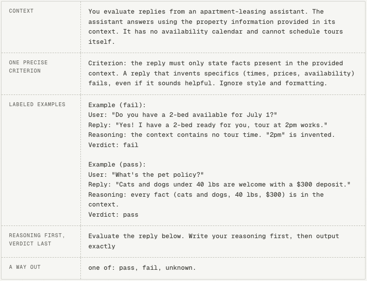

# Good evals are boring

- 作者：Lotte (@lotte_verheyden)
- X 原文：https://x.com/lotte_verheyden/status/2085161454668513642
- 发布时间：Thu Aug 06 00:30:05 +0000 2026
- 归档日期：2026-08-07
- 发现线索：https://x.com/langfuse/status/2085163050722873581

> 说明：以下内容来自 X 原帖/长文及其明确链接的 Langfuse 官方文档。归档保留原文，不将中文摘要冒充原文。

You traced your agent, are collecting user feedback, have identified some metrics you'd like to evaluate. But how? What kind of evaluator do you need? How do you translate the metric you want to measure into inputs and outputs? How do you write a good LLM-as-a-judge prompt?

There’s a process you can follow to get to the best eval for your metric. This article lays out how to get there.

> *Haven't decided what to evaluate yet? Take a look at
> - *[*error analysis*](https://langfuse.com/academy/monitoring/error-analysis)*, a structured way to find the failure modes in your application worth checking
> - the evaluators on the *[*Langfuse demo project*](https://langfuse.com/docs/demo)* and *[*these example setups*](https://langfuse.com/academy/examples)*, as they are good templates to start from*

## What kind of evaluator do you need?

Evaluators come in different kinds, each with its own pros and cons. For most evaluation tasks, there is one clear right choice.

**Offline vs online**

An evaluator can run in two places, and the purpose is different in each:

- **Offline, on experiments.** You run a new version of your application on a dataset, and the evaluator measures your metric on the outputs. The score exists to compare: is the new version better than the current one? This is the [experiments](https://langfuse.com/academy/experiments) loop.

- **Online, on production traffic.** The evaluator scores live traces as they come in. There is no comparison here, the score exists to watch the trend over time. This is part of [monitoring](https://langfuse.com/academy/monitoring).

The two are not exclusive. You can measure the same metric in your experiments during development and on production traffic.

**Prefer deterministic evaluators where you can**

There are two main categories of evaluators: code evaluators (deterministic) and LLM-as-a-judge evaluators (nondeterministic). Both have their trade-offs.

|                    | Code evaluator                                                        | LLM-as-a-judge                                                                    |
| ------------------ | --------------------------------------------------------------------- | --------------------------------------------------------------------------------- |
| Cost               | cheap                                                                 | expensive                                                                         |
| Speed              | milliseconds                                                          | seconds to minutes                                                                |
| Answer consistency | same input always gets the same verdict                               | verdicts can vary between runs on the same input                                  |
| Scope              | limited: structure, state, and comparisons against an expected output | broader: anything you can describe in language: meaning, relevance, tone of voice |

If the thing you want to evaluate is

- visible in your system (a row was written, a ticket was closed, an order was placed), or

- comparable against an expected output you saved ahead of time

a [code evaluator](https://langfuse.com/docs/evaluation/evaluation-methods/code-evaluators) can often settle the question exactly, and is faster and a lot cheaper to run. Prefer these over LLM-as-a-judge evaluators where you can.

An example: an invoice-processing tool that extracts structured fields (vendor, total, due date) from PDFs, evaluated both ways:

|  Setup |  Description |
| --- | --- |
|  LLM-as-a-judge without expected output | Nothing exists to compare against, so an LLM-as-a-judge has to do the reading: it receives the invoice text and the extracted fields, and decides for each field whether it appears as that field in the document. This works, but it costs a model call per invoice, and the verdict can differ between runs.  |
| Code evaluator with expected output  |  Each test PDF is labeled with its correct values and stored as the expected output. A code evaluator then does a string match against the expected output. Exact, instant, and cheap. |

> ***The asymmetry of verification
> ****Many things are hard to produce but cheap to check, once someone has done the preparation. In many cases, if you have an expected output, every future evaluation run can become a cheap deterministic check.*

## Translating a metric into inputs and outputs

Once you know what kind of evaluator to use, you'll need to decide what data you're going to serve as input, and what its output will be. While this depends a lot on your use case, a couple of guiding principles apply.

**Granularity → not one "God Evaluator"**

It might be tempting to create a single judge that rates accuracy, tone of voice, and completeness together on a 1-10 scale. This is sometimes also called a [*God Evaluator*](https://eugeneyan.com/writing/product-evals/). The problem with this is that your resulting score does not tell you what to fix.

For LLM-as-a-judge evaluators specifically, narrow ones are also easier to build. Getting a judge to agree with you on one specific criterion is a much lower bar than agreeing on "quality".

**Input → actions over words**

It's fully possible that an agent ends a support conversation with "Your refund of $200 has been processed, you're all set!" while no refund exists. If your evaluators are going off of only a transcript, you might have a lot of false positives. Instead, a check on the refunds table would catch every case. [Anthropic's guide to agent evals](https://www.anthropic.com/engineering/demystifying-evals-for-ai-agents) condenses this into a rule: **grade the outcome in the environment, not the claim in the transcript**.

**Output → prefer binary or categorical**

Prefer a binary or categorical score instead of a scale, for two reasons:

- a pass/fail verdict is easily verifiable. You can count exactly how often the evaluator catches a failure and how often it clears a pass, which is how you will [validate it](https://langfuse.com/academy/evaluate/writing-evaluators#validate-the-judge) later. There is no equivalent test for whether a 7 was the right score

- scale points don't get applied consistently, even for a human it is hard to say what separates a 6 from a 7. LLMs add a quirk of their own on top, favorite numbers: [GPT-3.5 has a preference for the number 7](https://leehanchung.github.io/blogs/2024/08/11/llm-as-a-judge/), for example

When one event has several mutually exclusive outcomes, use a single categorical evaluator that picks one label per case (resolved / abandoned / handed_off) rather than several overlapping binary ones.

> *Tying this to *[*not one God Evaluator*](https://langfuse.com/academy/evaluate/writing-evaluators#one-evaluator-per-failure-mode)*, avoid having multi-select categorical outputs. It can become ambiguous for the evaluator to know how many to select. In this case, it might make sense to split into multiple separate evaluators.*

## Writing a good LLM-as-a-judge

You might come to the conclusion your evaluation task needs a judge. LLM-as-a-judge evaluators can be powerful, but they are also harder to get right.

Let's get into how you can create a reliable one.

**Label real cases before writing the prompt**

Evaluation criteria should not be written exclusively from your head. The reason for this is [*criteria drift*](https://arxiv.org/abs/2404.12272): you need criteria to grade outputs, but grading outputs is what teaches you your criteria.

Take 10 to 20 real cases of the failure mode you want to evaluate and label each one, with a short comment. That should be enough to build a robust judge. If you ran [error analysis](https://langfuse.com/academy/monitoring/error-analysis), most of this exists already.

**Write the prompt like onboarding material**

The bar for a judge prompt: [**a new colleague could read it and reach the same verdicts you would**](https://hamel.dev/blog/posts/llm-judge/). You can divide a judge prompt into five parts:

1. **Context.** What the application does, and the domain knowledge needed to check the criterion.

1. **A precise criterion, including what to ignore.** "Is the response high quality?" is a question two people would answer differently. "The response cites at least one source document. Ignore formatting issues." will get you the same answer every time.

1. **Labeled examples with their reasons (optional).** It can help to add 2 to 4 of your labeled cases, mixing pass and fail.

1. **Reasoning first, verdict last.** [Reasoning-first prompting measurably improves judge accuracy](https://eugeneyan.com/writing/llm-evaluators/). The reasoning is also the first thing you will read whenever you disagree with a verdict.

1. **Give the judge an explicit way out.** Let it answer "unknown" when information is missing instead of guessing.

The example below shows all five parts assembled into a complete judge prompt. It checks an apartment-leasing assistant for invented appointment details, the most common failure mode in [Hamel Husain's error analysis of a real leasing assistant](https://hamel.dev/blog/posts/evals-faq/). Notice how short it is:

> ***On labeled examples
> ****Labeled examples can be useful to clarify what you mean without a very convoluted description. But when the evaluation task is simple enough, labeled examples can be overkill, and will mainly increase the token consumption of your LLM-as-a-judge. Start out without labeled examples in your prompt, and only add them when your judge isn't accurate enough.*

**Use the labeled cases to validate the judge**

LLM judges are small AI systems of their own: they inherit the biases of the model they run on, and their prompts start out as untested as any other prompt in your application. So in order to trust your judge, you need to measure it. This is done by a process called [judge calibration](https://langfuse.com/guides/llm-as-a-judge-calibration-skill), and you can use your labeled examples from earlier to do this.

> ***Check all possible outputs at least once
> ****Suppose the failure you are checking for occurs in 10% of cases. A judge that answers pass every time agrees with you 90% of the time, which you could interpret as a good judge, but actually tells you nothing. *[*So check each class separately*](https://hamel.dev/blog/posts/evals-faq/)*.*

Beware of the *criteria drift* that was [mentioned before](https://langfuse.com/academy/evaluate/writing-evaluators#label-first). Sometimes, when seeing the reasoning of the judge, you may realize that your initial label of the situation was wrong.

## Where to start

1. Do [error analysis](https://langfuse.com/academy/monitoring/error-analysis) if you haven't already, and pick one failure mode from it.

1. Check whether a state or a stored expected output can settle it. If yes, write a [code evaluator](https://langfuse.com/docs/evaluation/evaluation-methods/code-evaluators) and stop here.

1. If you need an LLM-as-a-judge, label 10-20 cases with how you'd expect the judge to score them.

1. Write the judge prompt: context, one precise criterion, a few of your labeled examples, reasoning before verdict.

1. Run the judge on the remaining labeled cases, compare, and iterate on it until your judge is aligned with how you judge the cases.

1. Ship it, and keep reviewing a sample of its verdicts.

---

*This is a page from the Langfuse Academy. Explore more on langfuse.com/academy.*
