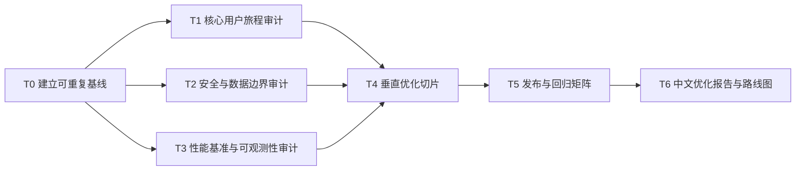

# 数字化 AI 助手项目梳理与优化计划

> 状态：T0–T6 已完成  
> 日期：2026-08-09  
> 范围：`/Volumes/WorkSSD/项目/pi-web-desktop`  
> 已完成健康基线、核心旅程、安全修复、性能预算、垂直切片、CI 与 macOS 发布候选验证

## 1. 目标

对 Electron-first 的数字化 AI 助手做一次证据驱动的系统梳理，找出影响用户体验、稳定性、性能、安全、发布质量和维护效率的问题，并形成可分批实施、可验证、可回滚的优化路线。

最终主交付物为：

- `docs/desktop-assistant-optimization.zh-CN.md`：项目现状、核心链路、问题证据、优先级、建议方案、风险和验证结果。
- `tasks/todo.md`：可逐项勾选的执行清单。
- 后续每个实施批次对应独立变更、测试结果和文档更新；不把无关重构混入优化提交。

## 2. 范围与假设

### 2.1 默认假设

- 产品定位以 Electron 桌面端为主，Web/LAN 模式保留，但不作为 UI 基线。
- 当前自动发布主平台是 Windows x64；macOS 需要纳入桌面行为和快捷键验证，Linux 作为兼容性检查项。
- 优先级顺序为：数据/安全与运行可靠性 > 核心交互体验 > 可测量性能 > 发布质量 > 可维护性 > 新能力。
- 保护本项目的桌面 UI、主题、字体、流程时间线、侧边栏和增强 Markdown；不以替换上游整组件的方式优化。
- 现有 Langfuse 文档是候选可观测方案，不默认等于立即接入；隐私、成本和 fail-open 验证通过后再决定。

### 2.2 非目标

- 不做无证据的大规模重写。
- 不为了缩短文件而机械拆分组件。
- 审计阶段不直接升级依赖；确认漏洞与发布兼容性后以独立切片升级并验证。
- 不覆盖当前未提交的 `electron/main.js`、`electron/mac-edit-shortcuts.js`、`electron/mac-edit-shortcuts.test.mjs`。
- 不运行会污染 `.next/` 的生产构建；打包验证放到单独的发布检查点。

## 3. 已确认基线

| 项目 | 当前证据 | 计划含义 |
| --- | --- | --- |
| 应用与 SDK | `package.json` 为 `0.8.6-f`，Pi SDK 为 `0.84.0`，Next 为 `16.3.0` | README 与最终报告已同步 |
| 代码规模 | `app/components/hooks/lib/electron` 约 37,402 行 | 优先关注高耦合热点，不以总行数作为重构理由 |
| 最大热点 | `ChatInput.tsx` 3,111 行、`SessionSidebar.tsx` 2,257 行、`useAgentSession.ts` 1,909 行 | 先补行为边界和性能证据，再决定最小拆分点 |
| API 表面 | 36 个 Route Handler | 需要统一检查鉴权、输入边界、错误契约和缓存行为 |
| 自动化测试 | `npm test` 显式限定源码目录；最终计数以 T6 验证记录为准 | macOS realpath 假失败和 release/临时脚本误发现已修复 |
| TypeScript | `tsc --noEmit` 通过 | 作为每批变更的固定门禁 |
| Lint | T0 后通过 | 3 个一次性诊断脚本已精确移出正式 Lint 范围 |
| CI | 三平台 PR 快速矩阵 + Windows x64 发布 + macOS arm64 手动打包 | 本机验证 workflow 语法与脚本；平台运行由对应 runner 完成 |
| 本地体积 | `.next` 约 1.2 GB、`release` 约 3.7 GB | 仅是工作区产物信号；需另测安装包、解压体积和冷启动，不直接据此下结论 |
| 现有文档 | 已有架构文档、上游同步记录、Langfuse 规划 | 新报告引用并校正，不复制大段已有内容 |

## 4. 成功标准

完成本计划后应满足：

1. 每条 P0/P1 结论都有代码位置、复现步骤、测试结果或测量数据，不能只写主观建议。
2. 所有优化项都有影响面、投入、风险、依赖、验收标准和回滚方式。
3. 基础门禁稳定：源码测试、TypeScript、Lint 可通过同一组明确命令重复执行。
4. 核心桌面旅程有验证矩阵：启动、选项目、开会话、发消息、流式恢复、工具执行、文件预览、设置、托盘和退出。
5. 安全审计覆盖 Electron IPC、BrowserWindow、HTTP Host/Origin/Auth、文件 allow-list、项目信任、凭据和日志脱敏。
6. 性能结论基于基准样本，而不是根据组件大小猜测；至少测量启动、长会话打开、流式渲染、大工具输出、文件索引和内存趋势。
7. 最终文档给出 Now / Next / Later 路线，并把第一批实施控制在可独立验证、可回滚的垂直切片内。

## 5. 依赖关系



`T1`、`T2`、`T3` 在基线稳定后可以并行取证，但任何业务改动都要等对应问题完成复现和验收定义。

## 6. 执行阶段

### T0：建立可重复的健康基线（P0，已完成）

目标：先让“是否变好”可被稳定判断。

任务：

- 固化源码测试选择方式，避免把 API 的 `test/route.ts`、临时脚本或 `release/` 产物误当测试。
- 修复 macOS 临时目录 realpath 断言，使 `/var` 与 `/private/var` 不再造成假失败。
- 处理诊断脚本的 3 个 Lint 错误和 1 个警告，或明确将真正的临时诊断文件移出正式 lint 范围。
- 记录 Node、Electron、Next、Pi SDK、操作系统和架构版本。
- 校正 README 中应用版本和 SDK 基线；版本来源尽量自动化或单点维护。

验收：

- 一条明确的测试命令在本机连续执行两次均通过。
- `tsc --noEmit` 与 `npm run lint` 通过。
- CI 与本地使用相同的测试文件选择规则。
- 只修改与门禁或文档漂移直接相关的文件。

验证：

```bash
npm test
./node_modules/.bin/tsc --noEmit
npm run lint
git diff --check
```

检查点 C0：提交基线结果供人工确认；在门禁未稳定前不进入结构性优化。

### T1：核心桌面用户旅程与体验审计（P0/P1，已完成）

目标：按用户完成任务的路径审计，而不是按目录横向罗列组件。

旅程 A——启动与恢复：

- 冷启动、已有本地服务、端口占用、服务启动失败、窗口重开、托盘恢复、单实例、退出清理。
- 校验日志是否足以定位白屏、Renderer 崩溃和服务进程提前退出。

旅程 B——项目与会话：

- 首次选择 cwd、最近工作区恢复、草稿会话、会话切换、Fork、会话内分支、Worktree 创建/删除和脏目录确认。
- 检查失败、加载、空状态和恢复状态是否清晰，是否会产生“选错项目/会话”的隐性风险。

旅程 C——一次完整 Agent Run：

- 输入、图片和 `@file`、模型/Thinking/工具选择、prompt、SSE、工具结果、compaction、agent_end、完成音效。
- 覆盖刷新、网络离线/恢复、后台标签页、SSE 半开、旧 run 延迟事件、abort、steer/follow-up。
- 明确用户可见的不变量：不重复消息、不出现幽灵流式气泡、不丢最终消息、不把旧事件写入新 run。

旅程 D——文件与设置：

- 文件索引、预览、Markdown 本地图片、Git diff、外部拖入、右键“在文件夹中显示”。
- 模型认证、API Key、OAuth 取消、技能/插件安装更新、项目 trust 门禁、主题和语言切换。

验收：

- 每个旅程形成“正常路径 + 失败路径 + 恢复路径”的检查表。
- 每个确认问题附最小复现、影响等级和建议测试层级。
- 至少选出 3 个最影响桌面体验的 P0/P1 候选，不先承诺修复未复现的问题。

检查点 C1：评审问题清单，确定第一批真正要实现的用户旅程切片。

完成记录：使用隔离的 Pi agent 目录、临时 Git 项目和 Electron 用户目录完成四条旅程。确认并修复空 Fork 未落盘、Webpack API 500、文件 watch 反馈环、服务退出隐藏、内置 Skill 目录错误和首次使用文案错误；详细证据见优化报告第 6–8 节。

### T2：安全、隐私与数据完整性审计（P0/P1，已完成）

目标：确认 Electron 主进程、本地 HTTP 服务和项目文件之间没有边界断层。

审计项：

- BrowserWindow：`contextIsolation`、`nodeIntegration`、sandbox、导航/新窗口限制、外链打开策略。
- IPC：逐项检查参数类型、路径规范化、允许根、调用窗口来源和错误回传；重点验证 `showItemInFolder` 不可被任意 Renderer 路径绕过服务器 allow-list。
- HTTP：Host、Origin、Sec-Fetch-Site、Basic Auth、LAN 模式、CORS、SSE 与 Electron readiness 的兼容性。
- 文件：realpath、符号链接、UNC/Windows 大小写、上传体积、会话引用、Git/Worktree、主题与技能路径。
- 信任：项目扩展、插件、Prompt、Skills 的加载和执行是否始终经过 project-trust。
- 敏感数据：API Key、OAuth 状态、模型错误、bash 输出、绝对路径、图片 Base64、系统提示词和日志保留。
- 数据完整性：Fork 后 wrapper 销毁、并发启动锁、JSONL 重写、原子写入、进程异常退出与空闲回收。

验收：

- 建立 renderer → preload → IPC → filesystem 与 browser → proxy → route → service 的边界表。
- 每个高风险入口至少有一个负向测试；发现的 P0 问题先单独修复，不与 UI 重构捆绑。
- 明确 Langfuse 如接入时的默认脱敏字段、opt-in 方式、fail-open 和退出 flush 上限。

检查点 C2：任何 P0 安全或数据完整性问题先阻断后续功能优化，完成单独修复与回归。

完成记录：修复 canonical path/symlink 逃逸、Electron sandbox/导航/IPC 来源、`showItemInFolder` 服务端授权、主题 HTTP 路径输入、凭据/上传原子写和 OAuth token；升级依赖后完整 `npm audit` 为 0。规范报告位于 `docs/security-scan-2026-08-09/`。

### T3：性能与可观测性基准（P1，已完成）

目标：找出真实瓶颈，避免看到大文件就直接拆分。

基准场景：

- Electron 冷启动和热启动：进程启动、HTTP ready、BrowserWindow 可交互。
- 典型/长会话：历史加载、分支上下文、滚动、历史 thinking/base64 延迟加载。
- 流式消息：高频 message_update、Markdown 增量、语法高亮、Mermaid/KaTeX、流程组和大工具结果。
- 大项目：文件索引、搜索、文件树、Git status/diff、Worktree 切换。
- 长时间运行：SSE/reconciliation 定时器、AgentSession registry、缓存、图片和 DOM/内存增长。

方法：

- 先制作固定测试夹具与参考机器说明，再记录 p50/p95 或稳定的本地多次测量。
- 使用 React Profiler、Performance trace、Node/Electron 计时和进程内存；临时诊断不进入生产路径。
- 为关键阶段增加低成本结构化本地日志；是否接入 Langfuse 另行决策。

暂定性能护栏（完成第一次基准后冻结）：

- 相同参考机器和固定夹具下，优化后关键指标不得比基线回退 10% 以上。
- SSE 恢复后最终状态应在下一次 reconciliation 周期内收敛，且不重复结束事件。
- 流式更新保持现有合并调度，不因每个 token 触发完整消息树重算。
- 30 分钟固定负载测试结束后，停止输入并回收空闲资源，内存不继续单调增长。

验收：

- 每个性能建议带 before 数据、after 目标、测量脚本/步骤和环境。
- 只有确认在火焰图、提交次数、I/O 或内存上形成主要成本的代码才进入优化。
- 对 `ChatInput`、`SessionSidebar`、`useAgentSession` 等热点区分“复杂度风险”和“性能瓶颈”。

检查点 C3：评审基准报告并冻结第一轮性能预算。

完成记录：固定 Apple M4/16 GiB 参考环境和 200/5,000-message、80-section Markdown、4.8 MB 工具结果、50,000-file、1,000-file Git 夹具；开发/生产 Electron 和 Chromium 指标已采集，预算已冻结。30 分钟 soak 完成 175,300 轮和 30 个样本，GC 后 heap 为 43.77 MiB，未发现单调增长。详见 `docs/desktop-performance-baseline-2026-08-09.md`。

### T4：按垂直切片实施优化（P0/P1/P2，已完成）

每个切片同时包含用户路径、最小代码改动、自动测试、手工桌面验证和文档更新。

建议顺序：

1. **门禁与文档一致性切片**：测试发现、macOS realpath、Lint、版本基线。
2. **桌面启动与 IPC 边界切片**：启动错误、动态端口、窗口/托盘生命周期、IPC 路径授权。
3. **聊天恢复切片**：SSE 连接、run id、reconciliation、刷新/后台/离线、最终 JSONL 对齐。
4. **工作区与文件切片**：项目恢复、文件索引、Git/Worktree、拖入和预览的性能与边界。
5. **长会话渲染切片**：历史分页、流式 Markdown、流程步骤和大工具结果；先测后改。
6. **设置与资源管理切片**：模型/Auth、技能、插件、trust 的取消、失败、刷新和反馈一致性。
7. **最小架构拆分切片**：仅抽离已经有独立状态/测试边界的部分，保持 `AppShell` 和高冲突桌面组件的外部行为。
8. **可观测性切片（可选）**：优先本地结构化事件；Langfuse 仅在隐私、配置、离线和 fail-open 评审通过后实施。

每个切片的 Definition of Done：

- 有一个失败测试或可重复基准证明问题存在。
- 变更行可追溯到该问题，无邻接清理。
- 单元/集成测试、TypeScript、Lint、diff check 通过。
- 涉及 Electron 的切片完成至少一个打包应用 smoke test。
- 涉及跨平台路径/快捷键的切片完成对应平台矩阵验证。
- 有明确回滚点；SDK、安全、SSE、UI 和发布变化分开提交。

完成记录：8 个切片均已关闭；长会话切片依据基准保留现有架构，没有做无证据大组件重写；可观测切片采用默认关闭的本地 Electron/Chromium 指标，Langfuse 暂缓。

### T5：测试、CI 与发布质量（P1，已完成）

目标：把已验证的优化变成持续门禁。

任务：

- 增加 PR 级快速 CI：源码测试、TypeScript、Lint、`git diff --check`，不必每次生成安装包。
- 保留 Windows x64 打包与 `/api/home` smoke test，并覆盖动态端口或占用默认端口场景。
- 增加 macOS 的 Node/Renderer 快速检查；条件允许时增加未签名打包 smoke。
- 统一测试命令，避免 shell glob 在不同平台行为不一致。
- 记录安装包/解压体积、启动耗时、Node/Electron/SDK 版本和关键 smoke 结果。
- 补充崩溃、服务启动失败和日志采集的故障演练步骤。

验收：

- PR 可在不打包的情况下快速阻止测试、类型和 Lint 回归。
- 发布流程验证的是实际打包目录，而不是开发服务器。
- Windows/macOS 特有行为有明确测试归属，不能只靠同一套纯函数测试声称跨平台通过。

检查点 C4：执行一次完整发布候选验证后，才能把对应切片标记完成。

完成记录：新增 Ubuntu/Windows/macOS PR 质量矩阵、macOS arm64 workflow 和包验证器；增强 Windows 动态端口 smoke。本机完成 Next production build、832 MiB macOS arm64 目录包、结构验证、固定/占用端口实际启动。

### T6：生成中文 Markdown 优化报告（P0，已完成）

`docs/desktop-assistant-optimization.zh-CN.md` 建议结构：

1. 执行摘要与 Top 10 优化机会。
2. 当前版本、架构和核心用户旅程。
3. 健康基线与验证命令。
4. P0/P1/P2 发现表：证据、影响、方案、投入、风险、验收。
5. 启动、聊天、工作区/文件、设置、发布五条链路的详细结论。
6. 安全与隐私边界图。
7. 性能基准与预算。
8. Now / Next / Later 路线和建议提交切片。
9. 已知限制、暂缓项和回滚策略。
10. 附录：验证记录、环境、相关现有文档链接。

验收：

- 文档中的版本和命令与仓库一致。
- 每个 P0/P1 项有源码链接或复现证据。
- 已实施、已验证、建议、暂缓四种状态明确区分。
- 架构文档和 Langfuse 计划只做引用/差异说明，不产生互相冲突的重复事实。

完成记录：主报告、性能基线、安全扫描报告和执行清单已互相链接；版本、命令、本地链接、实测/未测边界与最终验证结果均已校准。

## 7. 优先级判定

| 等级 | 判定 | 示例 |
| --- | --- | --- |
| P0 | 可能造成凭据/文件越界、数据损坏、无法启动、会话状态错误或发布门禁失真 | IPC 路径越权、Fork 状态污染、测试假绿/假红 |
| P1 | 高频核心体验明显受损，或可测量的性能/恢复/跨平台问题 | SSE 恢复、长会话卡顿、启动不可诊断、macOS 快捷键 |
| P2 | 维护成本、低频一致性或非阻断性体验问题 | 大组件边界、设置反馈统一、文档自动同步 |
| P3 | 新能力或暂时没有证据支持的美化 | 未验证的 UI 重做、非必要抽象、默认接入外部遥测 |

## 8. 风险控制

- 当前工作区非干净状态；实施时先重新确认 `git status`，不覆盖用户的 Electron 改动。
- `AppShell.tsx`、`SessionSidebar.tsx`、`ChatWindow.tsx`、`ChatInput.tsx`、`MarkdownBody.tsx`、`FileViewer.tsx`、主题和全局 CSS 都按高冲突资产处理。
- 改 Host/Origin/Auth/CORS/监听地址时，必须同时验证 Electron readiness 和 BrowserWindow 启动。
- 改 AgentSession、Fork、SSE 或缓存时，必须以 JSONL 最终状态和旧 run 事件隔离为验收核心。
- 修改 SDK 或依赖单独立项，不与 UI/性能优化同时进行。
- Langfuse 或其他外部可观测服务必须默认关闭、服务端持钥、脱敏、离线可用且失败不影响 Agent 主链路。

## 9. 建议评审决策

开始实施前只需确认三点：

1. 第一批是否按“基线门禁 → 启动/IPC → 聊天恢复”顺序推进。
2. 正式支持平台是否定义为 Windows x64 + macOS arm64，Linux 仅尽力兼容。
3. Langfuse 本轮是“只做接入决策与本地指标”，还是进入实际集成。
